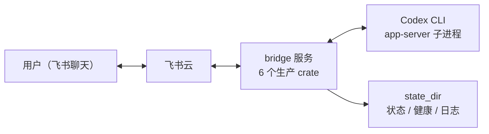

# Feishu Codex Bridge

使用原生 Rust 服务把飞书消息、卡片和附件连接到本机已登录的 Codex app-server：飞书长连接负责接收消息与卡片回调，Codex JSON-RPC 负责执行任务，版本化本地状态负责会话、目录与去重，两层监督器负责进程健康。全程只有一个 Rust 二进制，不需要额外的语言运行时。



## 快速开始

需要 Linux、Bash、C 编译器、Rustup 以及已安装并登录的 Codex CLI。首次配置和启动：

```sh
./setup.sh
./start.sh status
```

脚本生成权限为 `0600` 的 `bridge.toml`。飞书 App ID、App Secret 和可选配对码只从环境或交互输入取得，不写入配置文件，已有配置不会被覆盖。首次使用时在飞书聊天里发送 `/pair <配对码>` 完成配对。

常用操作：

```sh
./start.sh start        # 后台启动（guard → supervise → run 三层进程链）
./start.sh foreground   # 前台运行，便于观察日志
./start.sh status       # 查看健康与飞书连接状态
./start.sh restart
./start.sh stop
```

配置示例见 `bridge.example.toml`，字段与子命令的完整参考见 [配置与命令参考](docs/configuration.md)，部署步骤见 [部署指南](docs/deployment.md)。

## 功能

- 私聊与群聊消息、富文本（post）、图片和文件附件；单条消息最多 10 个附件，附件进入工作区 `feishu-inbox/` 后作为本地图片或数据文件交给 Codex。
- 文本命令：`/help`、`/status`、`/new`、`/resume`、`/archive`、`/archived`、`/unarchive`、`/compact`、`/cd`、`/cd-confirm`、`/model`、`/models`、`/plan`、`/stop`、`/approve`、`/deny`、`/pair`。
- 命令/文件审批、逐题问答、Plan 确认、流式进度预览和最终 Markdown 卡片回复。
- 用户授权（白名单或配对码）、消息去重、会话/目录/模型设置持久化、目录创建确认。
- 原生飞书 WebSocket（pbbp2 帧协议）、HTTP/SOCKS 代理、心跳与热更新重连、有界缓冲。
- 服务锁、App ID 全局锁、日志轮转、健康心跳、异常退避重启与后代进程清理。

## 文档

| 文档 | 内容 |
|---|---|
| [架构说明](docs/architecture.md) | 系统上下文、crate 依赖边界、进程链与监督、运行时任务拓扑、核心机制与不变量 |
| [运行时序图](docs/runtime-flows.md) | 消息任务、审批与问答、目录切换、压缩、停止、重连、关机等端到端时序 |
| [实现参考](docs/crates/README.md) | 每个 crate 一篇：模块清单、关键类型、控制流与常量表，全部对应到源码路径 |
| [配置与命令参考](docs/configuration.md) | `bridge.toml` 字段、凭据环境变量、`bridge` 子命令全集 |
| [部署指南](docs/deployment.md) | 源码部署、二进制包部署与打包流程 |
| [运维指南](docs/operations.md) | 健康检查、状态解读、故障处理与生产验收清单 |
| [开发指南](docs/development.md) | `cargo xtask check`、测试体系、协议快照维护、依赖边界门 |

## 开发验证

```sh
cargo xtask check
```

统一入口依次执行 fmt、Clippy（`-D warnings`）、串行 workspace 测试、产品构建、rustdoc（warnings 视为错误）、依赖边界、Codex 协议快照校验、仓库卫生、Shell 语法、diff 检查和打包结构校验。`cargo xtask fetch` 预取依赖后，可用 `cargo xtask check --offline` 完全离线执行。依赖边界与协议快照校验也可单独运行：`cargo xtask check-boundaries`、`cargo xtask codex-schema check`。发布打包使用 `cargo xtask package [输出目录]`，根目录 `package.sh` 是它的转发入口。

测试不读取真实配置、不访问外部服务、不启动长期服务；网络协议测试使用本地 socket 与内存流。协议假进程和 schema 校验由 Rust 测试工具完成，协议 fixture、生产序列化与真实解码均对照 `schemas/` 下版本化 schema 校验，协议基线版本集中在 `bridge_codex::protocol::CODEX_SCHEMA_BASELINE`。开发约定见 [开发指南](docs/development.md)。

## 当前状态

工程整改与架构可述性重构均已完成并合入主分支；历史整改计划与进度记录已从仓库移除，可在 git 历史中查看。当前系统边界见 [架构说明](docs/architecture.md)，运行时序图见 [runtime-flows.md](docs/runtime-flows.md)。

## 发布状态

离线回归不等于生产验收。真实飞书交互、当前 Linux 部署环境的服务生命周期和 72 小时稳定性仍须按 [运维指南](docs/operations.md) 验证并记录，未完成前不要宣称生产切换完成。
