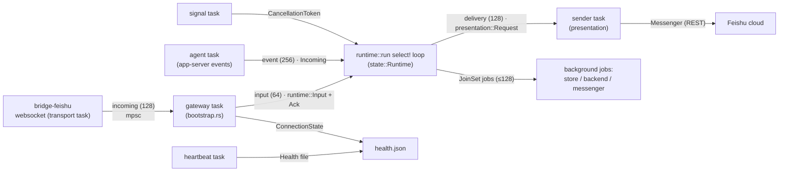

# Architecture

This describes the current implementation, including known responsibility overlap. [PLAN.md](../PLAN.md) specifies the intended refactoring; it does not imply that those changes have already landed.

`bridge-core` defines shared commands, task/session identities and presentation types. Application ports use explicit boxed futures for object-safe asynchronous calls and fake injection; no change of async-trait mechanism is required by the current plan.

`bridge-cli` loads `bridge.toml`, validates credentials supplied through named environment variables, acquires the App ID lock, and assembles the native runtime. Its `guard → supervise → run` process chain provides restart policy, health publication, log rotation, and descendant cleanup.

`bridge-feishu` owns native WebSocket framing, heartbeat/reconnect behavior, proxy handling, REST calls, cards, media and event decoding. Accepted events enter bounded application channels and are acknowledged only after durable admission or deliberate rejection.

`bridge-app` owns authorization, command routing, scheduling, sessions, runtime approvals/questions, Plan flow and result presentation. It depends on ports rather than transport implementations. `bridge-app/src/interactions.rs` is the single interaction manager for approvals and question groups; the runtime consumes it through `runtime/state.rs`.

`bridge-codex` is the sole owner of Codex app-server stdin/stdout JSON-RPC. It converts protocol messages to typed application events and owns the Codex process group.

`bridge-local` owns versioned JSON state, deduplication, workspace containment, and the file primitives behind `bridge_app::files::LocalFiles`: safe directory opens, bounded snapshots and diffs, durable attachment staging and private stable upload handles. Result selection, per-task limits, delivery summaries and upload ordering live in `bridge-app` (`bridge_app::files::Deliveries`); messaging transport stays behind `bridge_app::messaging::Messenger`. Individual JSON writes are atomic and state access is lock protected; directory creation and state publication are not one cross-resource transaction.

Feishu events convert to application inputs inside `bridge-feishu` (`ingress::Received::into_runtime_input`); the CLI only routes lifecycle state, bounded admission and assembly. Runtime diagnostics use a typed, cloneable `bridge_app::diagnostics::Diagnostics` handle injected per run; `bridge-cli/src/logging.rs` provides the persistent, rotating infrastructure sink, and pre-diagnostics startup failures go through the bounded sanitized `startup_record` path.

## Runtime dataflow

One foreground run composes six async tasks around the serial runtime loop.
Boxes are tasks, arrows are bounded channels (capacity in parentheses) or
shared handles; every arrow below names a real symbol in the code.

Inside the loop, `state::Runtime` owns five state components — `Admission`
(authorization, pairing throttle, command dedup), `TaskTrack` (scheduler,
single active execution), `CardBook` (minted card actions, views,
generations), `Approvals` (interaction manager plus buffered protocol
context) and `SessionBook` (directories, confirmations, archive backlog) —
and delegates completions to `jobs::{session,task,card}` by causal flow.

## Runtime invariants to preserve

Ordinary tasks execute serially. Directory, session and preference changes use the scheduler's idle mutation gate; this remediation does not relax it. Task directories are captured and revalidated before execution. User/directory preferences are persisted before their in-memory selection changes.

Message admission is durably claimed before side effects. Claimed operations with failed or unknown outcomes are not automatically replayed. Approvals and card actions remain scoped to the owning user, chat and current task/turn, and incomplete question answers must not be submitted. Directory creation may leave a created directory when the later state commit fails; the runtime reports failure without changing the selected directory or automatically deleting user files.

Credentials are never stored in TOML or logs. Configuration, state, runtime health, logs and downloaded attachments remain separate boundaries.
