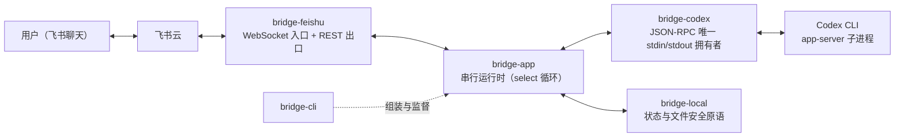
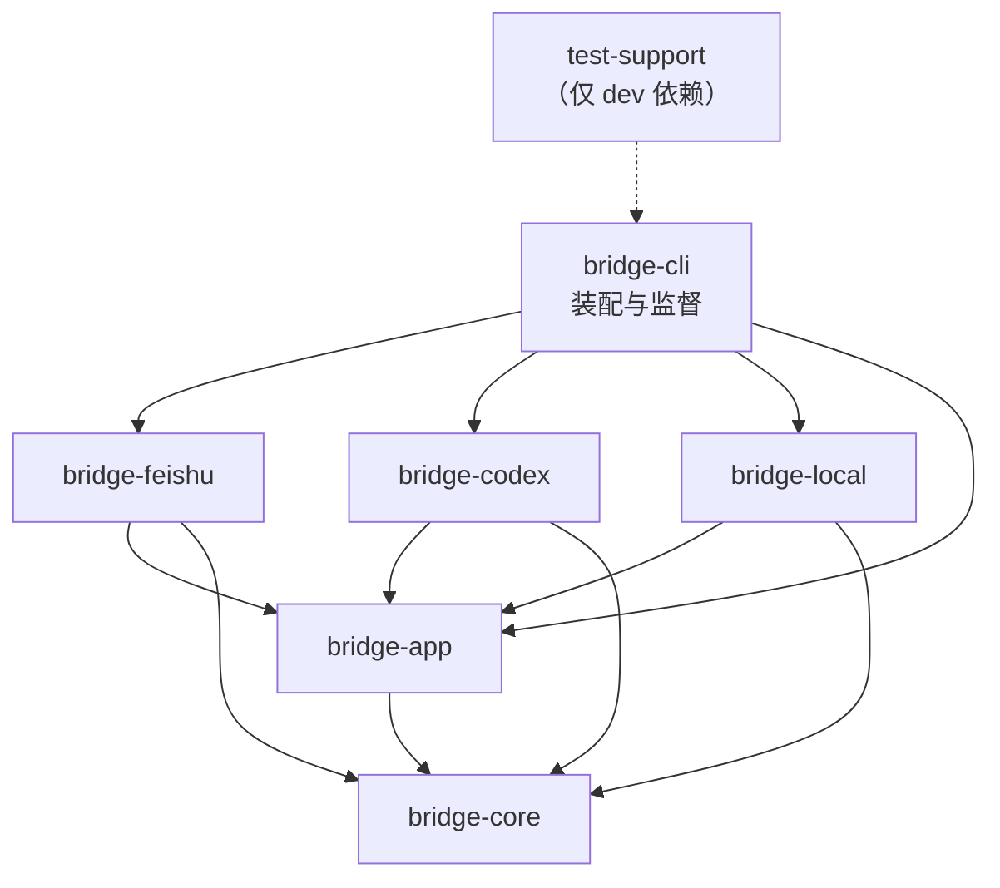
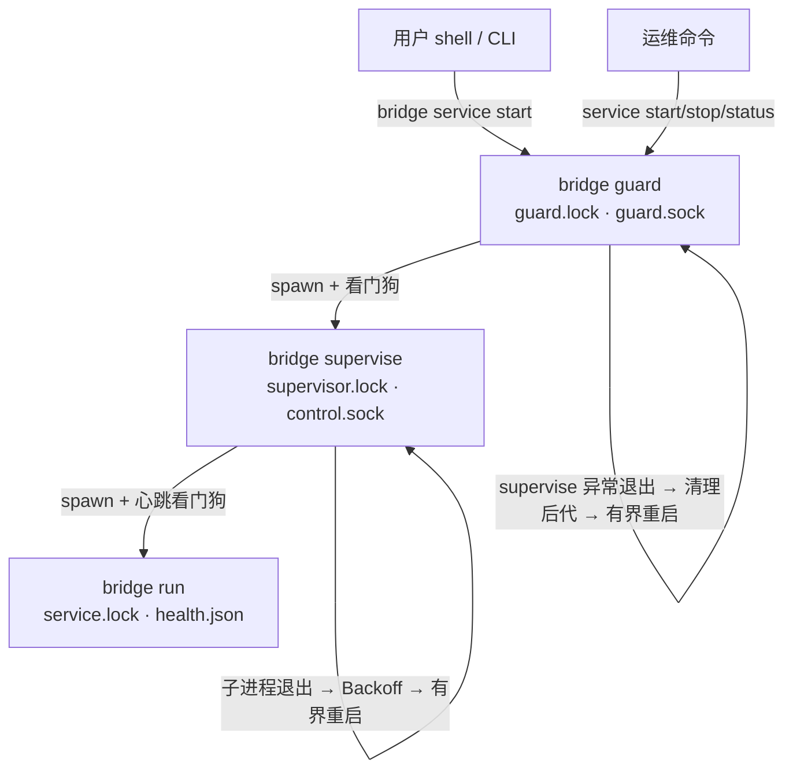
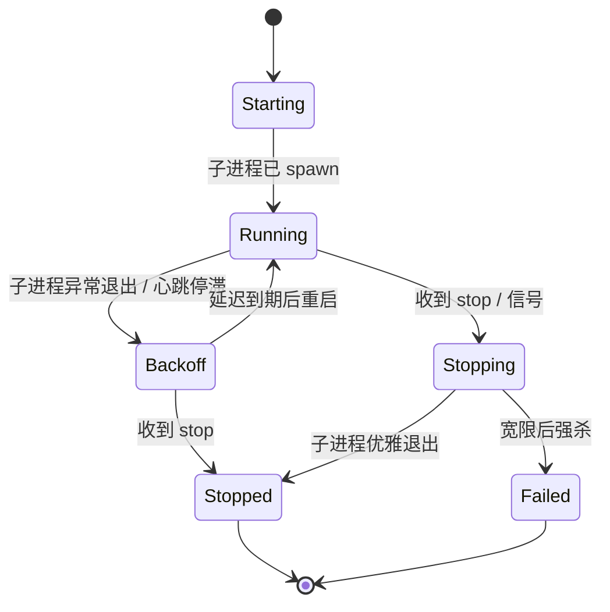
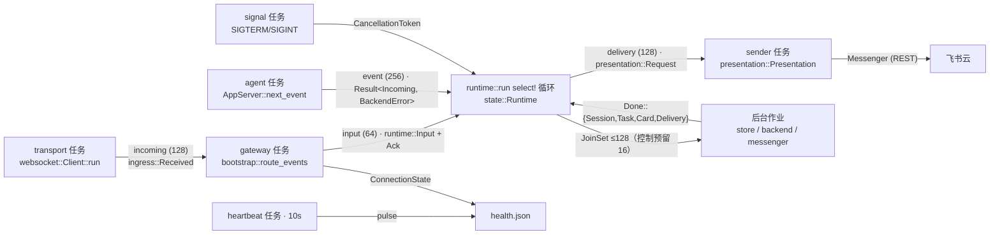

# 架构

本文描述当前实现的整体结构：系统上下文、crate 依赖边界、进程链与监督、运行时任务拓扑，以及贯穿其中的核心机制与不变量。图中的每个节点与边都能在代码里找到同名模块、类型或通道；每个 crate 的模块与常量级清单见 [实现参考](crates/README.md)，端到端时序见 [runtime-flows.md](runtime-flows.md)。

## 目录

1. [系统上下文](#系统上下文)
2. [仓库组织与依赖边界](#仓库组织与依赖边界)
3. [分层与端口](#分层与端口)
4. [进程链与监督](#进程链与监督)
5. [run 进程的任务拓扑](#run-进程的任务拓扑)
6. [串行运行时与状态组件](#串行运行时与状态组件)
7. [消息准入与恰好一次语义](#消息准入与恰好一次语义)
8. [任务执行与文件流](#任务执行与文件流)
9. [卡片、令牌与授权](#卡片令牌与授权)
10. [审批与问答](#审批与问答)
11. [会话、目录与持久状态](#会话目录与持久状态)
12. [Codex 适配层](#codex-适配层)
13. [飞书适配层](#飞书适配层)
14. [健康与诊断](#健康与诊断)
15. [有界性](#有界性)
16. [不变量](#不变量)
17. [词汇表](#词汇表)

## 系统上下文



六个生产 crate 的职责一句话各自可述（实现详解见对应篇章）：

- **[bridge-core](crates/bridge-core.md)** — 协议无关的文本命令、会话身份、任务生命周期与展示视图类型；无 IO。
- **[bridge-feishu](crates/bridge-feishu.md)** — 飞书原生 WebSocket 帧、心跳/重连、代理、REST、卡片渲染与事件解码（ingress）。
- **[bridge-app](crates/bridge-app.md)** — 端口（ports）定义、授权、命令路由、调度、会话、审批/问答、Plan 流与结果呈现；运行时循环见 [bridge-app 运行时](crates/bridge-app-runtime.md)。
- **[bridge-codex](crates/bridge-codex.md)** — Codex app-server 的 stdin/stdout JSON-RPC 唯一拥有者，并拥有 Codex 进程组。
- **[bridge-local](crates/bridge-local.md)** — 版本化 JSON 状态、去重、工作区路径校验与文件安全原语（`safeio`）。
- **[bridge-cli](crates/bridge-cli.md)** — 装配一切：`guard → supervise → run` 进程链、健康发布、日志轮转、后代清理、CLI。

测试设施与仓库工具链另有专篇：[test-support](crates/test-support.md)、[工具链与脚本](crates/tooling.md)。

## 仓库组织与依赖边界

```text
├── crates/
│   ├── bridge-core/          协议无关类型与命令解析（仅依赖 thiserror）
│   ├── bridge-app/           端口、串行运行时、应用行为（无厂商 SDK 类型）
│   ├── bridge-local/         JSON 状态存储、AsyncState、safeio、工作区与附件
│   ├── bridge-feishu/        飞书 WebSocket / REST / 代理 / 卡片渲染
│   ├── bridge-codex/         Codex JSON-RPC 传输、进程、协议快照
│   ├── bridge-cli/           配置、进程链、监督、健康、日志、CLI
│   └── test-support/         假 Codex 进程与共享测试装配（非发布）
├── xtask/                    仓库工具链：check / boundaries / codex-schema / package
├── schemas/codex/0.153.4/    版本化协议 schema 快照（manifest 锁定 SHA-256）
├── fixtures/codex/0.153.4/   协议 fixture（turn-start、服务端请求）
├── setup.sh / start.sh / package.sh
└── docs/
```

依赖方向是单向且白名单化的，由 `cargo xtask check-boundaries`（xtask/src/boundaries.rs）按真实包名强制：生产 crate 依赖 `xtask` 或 `test-support` 的普通/构建依赖一律拒绝，dev 依赖也必须在该 crate 的白名单内。`bridge-core` 不知道任何传输；应用行为只依赖端口；飞书、Codex、本地存储实现边界；CLI 负责组装。



## 分层与端口

bridge-app 定义全部厂商无关端口，三个适配 crate 分别实现。这是理解代码的钥匙：应用行为（runtime）只调用下表左侧的 trait，永远看不到飞书 JSON、Codex envelope 或文件系统细节。

| 端口（bridge-app 定义） | 语义 | 生产实现 |
|---|---|---|
| `AgentBackend`（ports.rs） | thread/turn/model 管理、compact、interrupt | `bridge-codex::backend::CodexBackend` |
| `ReplyHandle`（requests.rs） | 审批/问答的一次性回传 | `bridge-codex::requests::Reply` |
| `Messenger`（messaging.rs） | 交互卡片、文本、成果上传 | `bridge-feishu::rest::FeishuRest` |
| `ResourceFetcher`（files.rs） | 飞书附件下载 | `bridge-feishu::rest::FeishuRest` |
| `LocalFiles`（files.rs） | 快照扫描、diff、附件暂存、稳定句柄 | `bridge-local::workspace_files::WorkspaceFiles` |
| `TaskFiles`（files.rs） | 任务文件生命周期（bind/prepare/finish） | `bridge-app::files::Deliveries`（内置编排） |
| `SessionStore` + `DirectoryStore` + `DurableJournal`（sessions.rs、directories.rs） | 会话绑定/偏好、目录提案与创建、消息认领 | `bridge-local::async_state::AsyncState` |
| `MessageJournal`（lib.rs） | 离线（阻塞）消息认领 | `bridge-local::state::JsonStore` |
| `Sink`（diagnostics.rs） | 元数据诊断写入 | `bridge-cli::logging::Log` |

运行时把三个存储端口合并为一个对象安全 trait：`runtime::state::Store: SessionStore + DurableJournal + DirectoryStore`。

## 进程链与监督

`bridge service start` spawn 出三层进程链，每层用文件锁证明存活（绝不信任 PID）：



运行期文件全部位于 `state_dir` 下（相对路径）：

| 文件 | 归属 | 作用 |
|---|---|---|
| `guard/runtime/guard.lock`、`guard.sock` | guard | guard 唯一性；guard 层控制 socket |
| `guard/runtime/supervisor/snapshot.json`、`events.jsonl` | guard | guard 层阶段快照与日志 |
| `runtime/supervisor.lock` | supervise | supervise 唯一性 |
| `runtime/control.sock` | supervise | 控制 socket：单字节命令 `s`（Phase）/`p`（Pid）/`x`（Stop），JSON 应答 |
| `runtime/control.lock` | CLI | 串行化 service 控制命令 |
| `runtime/service.lock` | run | bridge 运行锁，`status` 的 running 判定依据 |
| `runtime/health.json` | run | 健康快照（原子发布：pending → rename → 目录 fsync） |
| `runtime/events.jsonl`（+ `.1..3`） | run | 运行诊断日志，2 MiB 轮转、保留 3 份 |
| `runtime/supervisor/snapshot.json`、`events.jsonl` | supervise | supervise 层快照与日志 |
| `state.json`、`state.previous.json`、`seen-messages.json`、`state.lock` | JsonStore | 持久状态、写前备份、去重日志、单写者锁 |

监督状态机（`supervisor_state::Phase`，控制 socket 以 JSON `LivePhase` 回答，`bridge status` 直接渲染）：



关键参数（crates/bridge-cli/src/supervisor.rs）：

| 参数 | 值 | 说明 |
|---|---|---|
| 退避序列 | 2、4、8、16、30…秒（封顶 30） | 失败超过 10 次放弃重启 |
| `STABLE_RUN` | 60 秒 | 运行短于此不重置重试预算（supervise 层） |
| `STARTUP_GRACE` | 120 秒 | 看门狗启动宽限，必须大于心跳间隔 + 新鲜度窗口 + 一轮探测 |
| `PROGRESS_GRACE` | 45 秒 | 心跳流动后的静默预算 |
| `WATCHDOG_PROBE` | 5 秒（单次探测限时 2 秒） | 看门狗只在内层 supervise 启用 |
| 停止宽限 | run 20 秒 / supervise 45 秒 | SIGTERM → 宽限 → SIGKILL → `descendants::clean()` |

另外两个保护：同一飞书 App ID 的全局互斥锁（`app_lock`，锁文件名为 App ID 的 SHA-256 前 24 个十六进制字符，目录 `$HOME/.feishu-codex-bridge`，可用 `CODEX_SERVICE_GLOBAL_STATE` 覆盖）；guard/supervise 都注册 Linux child-subreaper 并用 pidfd 发信号清理 Codex 孙进程，防止 PID 复用导致误杀或残留。

## run 进程的任务拓扑

一个前台 run 围绕串行 select 循环组成异步任务集；箭头即有界通道（标注容量），所有符号都真实存在于代码（crates/bridge-cli/src/bootstrap.rs 与 crates/bridge-app/src/runtime/mod.rs）：



| 任务 | 代码位置 | 职责与失败行为 |
|---|---|---|
| transport | `websocket::Client::run` | 飞书长连接；退出即 cancel |
| gateway | `bootstrap::route_events` | 连接状态写 health；业务事件转 `runtime::Input` 后 `try_send`，满即丢弃并记 `Overloaded`（不阻塞 transport） |
| agent | bootstrap 内联循环 | `server.next_event()` 泵入 event 通道；错误或通道满即 unhealthy 并 cancel |
| heartbeat | `health::heartbeat` | 每 10 秒 `pulse()` 写 health.json；写失败 cancel |
| signal | bootstrap 内联循环 | SIGTERM / Ctrl-C → cancel |
| sender | `runtime::run` 内 spawn | 消费 delivery 通道，按 `rich_output()` 走卡片或纯文本 |

桥接进程 epoch = UNIX 纪元纳秒（回退 PID），贯穿令牌、RPC 请求 id 与任务 id，使旧进程的任何标识都无法在新进程重放。启动期先做归档对账（`reconcile_archives`，60 秒超时）：读出本地全部绑定线程 → 对照后端归档列表 → 一次原子提交清除全部已归档绑定；失败不启动业务接收。

## 串行运行时与状态组件

select 循环每轮先执行 `state.maintain()`（簿记：归档同步、plan offer 过期、审批卡补发、面板刷新、成果投递、启动下一任务），再以 biased 优先级监听六个源：取消、发送器退出、`inputs.recv()`、`jobs.join_next()`、`events.recv()`、1 秒 tick。任何错误路径都返回 `RuntimeError`（Connection/Capacity/Interaction/Maintenance/Backend/Storage/Directory/Internal，文案可直接给用户）并停机——重启职责完全属于监督层，运行时绝不自动重试。

`state::Runtime` 把运行状态分组为六个可命名组件（runtime/state.rs），每个组件拥有自己的字段与不变量：

| 组件 | 职责 | 关键不变量 |
|---|---|---|
| `Admission` 准入 | 白名单、配对限流（60 秒窗口 10 次）、命令去重（1000 条记忆） | 输入恰好结算一次 `Ack`；丢弃即拒绝 |
| `TaskTrack` 任务轨 | 调度器（容量 64）、唯一活动执行、任务附件资源、`FileDelivery` 状态机 | 变更门由获取它的链条在终态事件释放 |
| `CardBook` 卡片簿 | 已铸按钮 `Actions`、已投递视图 `Views`（各 ≤1000）、每用户失效世代、刷新队列（≤128）、plan offer | 所有点击走 `resolve_click` 唯一校验入口 |
| `Approvals` 审批 | 审批/问答交互（≤32）与 FileChange 缓冲（≤32） | 未完成问答不提交；回传不确定即停机 |
| `SessionBook` 会话簿 | 每用户目录、创建确认（≤100）、归档积压（≤128） | 偏好在内存选择变更前持久化 |
| `Progress` 进度 | 与发送任务共享的 busy 原子量、预览节流（3 秒） | 进度失败不重试、不吞掉最终回复 |

活动执行 `Active` 携带：`ActiveKind::{Task, Compact{acknowledged, terminal, thread}}`、执行身份门 `gate: Execution`、`turn: Option<TurnRef>`、停止标志、累计输出（32 KiB 截断）、计划文本（16 KB 截断）。`FileDelivery` 状态机 `Idle → Holding → Delivering → Idle` 保证同一时刻只有一轮成果在整理。

## 消息准入与恰好一次语义

飞书事件回执与应用裁决通过 `Ack` 链路恰好一次地闭环：


业务事件的准入遵循「先持久化认领，再做副作用」：`Scheduler::reserve` 同步预留容量 → 后台作业调 `DurableJournal::claim`（写 `seen-messages.json`，FIFO 保留 1000 条）→ `commit_admission`/`abort_admission` 结果入队，磁盘乱序完成也保持 FIFO；取消或失败的认领绝不入队。消息 id 与卡片点击 id（`card:{token}`）共用同一去重日志，重复投递天然幂等。结果未知的已认领操作不自动重放——这是全部持久化路径的统一姿态（存储层对应 `StoreError::Uncertain`：提交失败后拒绝后续写入，必须重开存储）。

## 任务执行与文件流

文本任务的主推进链（函数名即阶段，详见 [runtime-flows.md](runtime-flows.md)）：

```text
admit_task → TaskDone::Admission（持久认领）
  → maintain::start_next_task：validate_directory → prepare_files（附件 staging）
      → sessions::prepare_configured（读偏好 → prepare()：resume/start 线程并绑定落盘）→ bind_files
  → TaskDone::Prepared：建 Execution 门 → backend.start_turn
  → TaskDone::Started：gate.bind(turn) 回放早期事件 → 协议事件流 → Outcome
  → flow::finish：scheduler.finish → delivery Answer → sender 投递 → finish_files
```

三个机制保证正确性：

- **执行身份门 `Execution`**（execution.rs）：turn/start 响应到达前收到的协议事件进 64 条的 early 缓冲；`bind` 恰好绑定一次并回放；事件身份（epoch + thread + turn）不匹配的输出永不进入当前任务；缓冲溢出视为协议失败停机。
- **变更门 `begin_session_mutation`**（lib.rs Scheduler）：只在全局空闲（无活动任务、队列空、pending 空）时可取得；目录、会话、偏好、压缩、/new 全程持门直到终态事件释放，任务运行中这些命令一律被拒。
- **文件管线**：入站附件经 `ResourceFetcher` 下载（45 秒超时、20 MiB 上限）→ `stage_attachment` 校验大小/图片魔数后以 `persist_noclobber` 原子发布到工作区 `feishu-inbox/{task}-{index}-{净化名}` → 路径附加进提示词、图片走 `localImage`。任务完成后 `finish_files` 对比前后快照：文本 diff 面板（每文件一张，4000 字符截断）+ 新增/变更产物上传（SHA-256 去重、每任务 ≤10 项、单文件 20 MiB）；`open_stable` 返回私有稳定句柄，上传进行中的文件不受后续编辑影响。`.env`、`.env.*`（除 `.env.example`）、`.feishu-codex*` 永不进入快照与 diff。

## 卡片、令牌与授权

所有卡片按钮在飞书侧只携带一个不透明的一次性按钮令牌（`{panel-prefix}-{index}`，choice 恒为 `"run"`）；真实命令串登记在运行时侧 `CardBook.actions`，点击通过五重校验后回填执行。令牌由 runtime/tokens.rs 唯一铸造：

| 令牌 | 格式 | 用途 |
|---|---|---|
| 面板前缀 | `panel-{epoch}-{序号}` | 每张卡的前缀；按钮令牌再追加 `-{index}` |
| 目录确认 | `cd-{epoch}-{序号}` | `/cd-confirm` 的创建确认令牌 |
| 审批/问答 | `approval-{epoch}-{序号}` | 交互条目标识，嵌在命令串里 |
| 计划确认 | `plan-{task}` | plan offer，每任务一个 |
| 点击回执 id | `card:{按钮令牌}` | 卡片点击的持久化输入 id，与消息 id 不撞 |

一次点击要过五道校验（`CardBook::resolve_click`）：按钮令牌存在、属于当前用户/聊天/目录、由这条消息送达、未过期（600 秒）、且停止/计划类按钮的 `TaskSnapshot` 仍与任务轨一致。列表卡片（`CardKind::List`）点击后整卡失效并入刷新队列重发新面板；交互卡片一次性消费。目录切换会给该用户世代号 +1，使全部旧按钮立即失效。

## 审批与问答

Codex 的审批/问答请求（服务端 JSON-RPC 请求）由 protocol.rs 注册进 `Interactions`（容量 32，600 秒有效），卡片投递延迟到 maintain 统一补发：

- **审批**（`item/commandExecution/requestApproval`、`item/fileChange/requestApproval`）：`can_allow` 要求执行环境/会话级授权等桥接无法表达的形态不存在、权限 overlay 与网络上下文可完整展示（≤4096 字节）、且必须同时可同意可拒绝；`grant_root`（会话级目录授权）存在时整体不可同意。展示不完整时拒绝同意但保留拒绝按钮——绝不静默截断安全细节后放行。
- **问答**（`item/tool/requestUserInput`）：三道门——仅 Plan 模式的存活 turn 支持、逐题可完整展示（选项 ≤20、文本总量 ≤16000）、题数 1–32。任何一道不过即停止本次运行且不提交空答案。
- **生命周期**：条目在任何异步写之前被消费（不确定的回复不会重新启用审批）；过期/任务死亡的条目在被移除前保持注册，保证「必需的拒绝」恰好发送一次；问答未答完就超时 → 停止运行；关机时 `drain()` 对全部未决条目回传拒绝。

## 会话、目录与持久状态

持久状态只有一个 JSON 文件（bridge-local/src/state.rs，schema_version = 1）：

```json
{
  "schema_version": 1,
  "sessions":     { "{user}:{workspace}": "thread-id" },
  "models":       { "{user}:{workspace}": "model-id" },
  "directories":  { "{user}": "/abs/path" },
  "plan_modes":   { "{user}:{workspace}": true },
  "allowed_open_ids": ["ou_xxx"]
}
```

写入协议：同目录 0600 私有临时文件 → fsync → `persist`（rename 原子替换）→ 目录 fsync；替换前先把旧状态备份到 `state.previous.json`；任何主提交失败置 `healthy = false`，此后所有变更返回 `Uncertain` 直到重开存储——内存永不领先磁盘，损坏/未来版本绝不静默重置。`AsyncState` 用 `Arc<Mutex<JsonStore>>` + 信号量（2 槽）+ `spawn_blocking` 包装它；permit 移入阻塞任务内部，调用者被取消也不放弃进行中的提交。

目录操作在 `Workspace` 中解析：`resolve_existing` 用 canonicalize 展开符号链接后要求仍处工作区内；`resolve_proposed` 对不存在的目标逐前缀归一化（已存在段展开链接）；创建走 `safeio` 的 openat + `O_NOFOLLOW` 链 + `mkdirat(0o700)`，确认时重算提案并要求与确认令牌中的目标完全一致。目标不存在时发一次性创建确认（每用户仅一份待确认，容量 100，600 秒有效）。

归档对账有两处：启动期 `reconcile_archives`（见「任务拓扑」）；运行期 `thread/archived` 通知进入积压（≤128），由 maintain 以 `begin_invalidation` 门调度 `clear_thread`，在同一次提交中清除该线程的全部绑定。

## Codex 适配层

bridge-codex 独占 Codex 子进程的 stdin/stdout（行分隔 JSONL，单帧上限 8 MiB），子进程以 `process_group(0)` spawn、退出时按进程组收割（SIGTERM → 100ms → SIGKILL → 2 秒等待）。RPC 请求 id 为 `{epoch}:{n}`，按 id 关联应答；30 秒超时；并发槽 32；出站通道 32、事件通道 256，事件满即 `Overloaded` fail-closed。

| 方向 | 方法 / 通知 | 映射 |
|---|---|---|
| 出站 | `initialize` + `initialized` | 握手（`experimentalApi: true`），失败即 spawn 失败 |
| 出站 | `model/list`、`thread/list`、`thread/read`、`thread/start`、`thread/resume`、`thread/archive`、`thread/unarchive`、`thread/compact/start`、`turn/start`、`turn/interrupt` | `AgentBackend` 九个方法 |
| 入站通知 | `turn/started`、`item/agentMessage/delta`、`turn/completed`、`item/completed`（plan）、`item/started`（fileChange）、`thread/archived` | `AgentEvent::{Started, Output, Finished, Plan, FileChanges, Archived}` |
| 入站请求 | `item/commandExecution/requestApproval`、`item/fileChange/requestApproval`、`item/tool/requestUserInput` | `AgentRequest` + 一次性 `ReplyHandle`；未知方法回固定 `-32602` |

`turn/start` 参数由生产序列化器 `turn_params` 直接拼装并被 fixture 锁定：文本 + `localImage` 图片、`approvalPolicy: "on-request"`（桥不预授权，全部走审批）、`collaborationMode`（`plan`/`default` + 模型）、sandbox `workspaceWrite`（writableRoots = 任务目录，禁网络）或 `dangerFullAccess`（显式配置选择）。协议形状由版本化快照锁定：`schemas/codex/0.153.4/`（manifest 逐文件 SHA-256）+ `fixtures/codex/0.153.4/`，基线常量 `CODEX_SCHEMA_BASELINE`（bridge-codex/src/protocol.rs）；升级走 `cargo xtask codex-schema export` 的显式维护流程（见 [开发指南](development.md)）。

## 飞书适配层

连接生命周期：`POST /callback/ws/endpoint` 发现 wss 端点（401/403 → Authentication）→ 经代理或直连完成 TLS WebSocket 握手（20 秒限时）→ 会话循环（心跳 + 回执 + 帧读取）。帧是飞书 pbbp2 protobuf（prost 定义，与官方 SDK 字节级对齐），payload 为 JSON；支持 64 片以内分片重组（全局 8 MiB 预算、单消息 2 MiB、5 秒 TTL），签名不一致的 assembly 整体丢弃（fail-closed）。

- **心跳**：按服务端下发的 `ping_interval`（默认 120 秒）发 ping；pong 截止 = `2×interval + 5` 秒，超时断连重连；pong payload 携带 `ClientConfig` 热更新（重连次数/间隔、ping 间隔，部分更新原子生效）。
- **重连**：首次重试 `rand() × nonce(30)` 秒抖动，之后固定 `reconnect_interval`（默认 120 秒）；一次连接存活 ≥60 秒才重置预算；Authentication/Proxy/Overloaded 不重试；达到 `reconnect_count`（默认 -1 无限）→ Exhausted。每轮重新发现端点。
- **回执**：待裁决回执上限 64（满即直接 NAK 背压）；应用 1 秒写预算内不裁决按拒绝处理。
- **REST**（FeishuRest）：tenant_access_token 缓存（提前 120 秒刷新）；发消息/更新卡片/上传图片与文件/下载资源；普通请求并发 4、上传下载共享并发 2；JSON 响应上限 2 MiB；文本回复按 3500 字符分片；业务码非 0 一律 `Rejected`（HTTP 200 也不掩盖）。
- **代理**：`Policy` 从显式配置或 `https_proxy/wss_proxy/all_proxy` 等环境选择（`wss` 目标回退 `https_proxy`），NO_PROXY 支持域后缀、CIDR、端口限定；HTTP CONNECT（Basic 认证）与 SOCKS5/5h（本地/远端 DNS）两种隧道；TLS 统一 rustls + webpki-roots。WS 与 REST 共用同一策略。

## 健康与诊断

health.json（`bridge-cli/src/health.rs`）字段：`version(1)`、`pid`、`started_unix_ms`、`updated_unix_ms`、`phase`、`heartbeat_unix_ms`；phase ∈ `Starting/Connected/Reconnecting/Stopped/Failed`（飞书连接维度，区别于监督层 Phase）。心跳每 10 秒写入，新鲜窗口 30 秒。`bridge status` 综合锁、两份监督快照、health 与控制 socket 的 `LivePhase` 渲染三行中文状态，不暴露 PID 与时间戳。

诊断只写元数据（bridge-app/src/diagnostics.rs）：23 种 `Event` + `Status`，单行 JSON（event/status/unix_ms/pid/task/count），task 字段只接受内部生成的 id；prompt、答案与远端错误文本永远进不了诊断。运行日志 `events.jsonl` 单条上限 4096 字节，2 MiB 轮转保留 3 份。

## 有界性

所有生产者共用 runtime/limits.rs 的同一组上限；超限的行为不是排队而是显式拒绝或停机（fail-closed）：

| 常量 | 值 | 语义 |
|---|---|---|
| `BACKGROUND_JOBS` / `CONTROL_JOB_RESERVE` | 128 / 16 | 后台作业硬上限；用户触发作业不得侵入控制预留 |
| `DELIVERY_QUEUE` / `DELIVERY_PROGRESS_RESERVE` | 128 / 8 | 回复队列；进度预览只允许用超额容量 |
| `INTERACTIONS` / `QUESTIONS_PER_REQUEST` | 32 / 32 | 待处理审批/问答；单请求题数 |
| `SCHEDULED_TASKS` / `SEEN_COMMANDS` | 64 / 1000 | 调度队列；命令去重记忆（满即清） |
| `ATTACHMENTS_PER_MESSAGE` / `INPUT_BYTES` | 10 / 32 KiB | 单消息附件数；任务文本上限 |
| `OUTPUT_BYTES` / `PLAN_BYTES` / `PREVIEW_CHARS` | 32 KiB / 16 KB / 1000 | 累计输出 / 计划文本 / 预览与失败原因 |
| `TASK_TIMEOUT` / `INTERACTION_TIMEOUT` | 1 小时 / 600 秒 | 单任务上限；审批/问答/确认有效期 |
| `TICK` / `PROGRESS_INTERVAL` | 1 秒 / 3 秒 | 维护节拍；进度预览间隔 |
| `MESSAGE_TIMEOUT` / `ANSWER_DELIVERY_TIMEOUT` | 45 秒 / 180 秒 | 单条消息 / 富文本完整回复 |
| `FILE_PREPARE` / `FILE_BIND` / `FILE_FINISH` | 120 / 60 / 180 秒 | 附件 staging / 生成图绑定 / 成果投递 |

网络与存储侧的有界值（帧 2 MiB、JSONL 8 MiB、REST 响应 2 MiB、去重日志 1000 条、附件 20 MiB、快照 200 文件/10 000 条目等）见 [实现参考](crates/README.md) 各篇的常量速查表。

## 不变量

- 普通任务串行执行；目录、会话与偏好修改走调度器的空闲变更门，任务运行中一律拒绝。
- 任务目录在执行前捕获并重新校验；已删除、移动或被符号链接重定向的目录快照拒绝开工。
- 消息准入先持久化认领，再做副作用；`Ack` 恰好结算一次，Drop 即 NAK；结果未知的已认领操作不自动重放。
- 审批与卡片动作限定于属主用户、聊天与当前任务/回合；未完成的问答不得提交；条目在任何异步写之前消费。
- 一旦进入 `Delivering(Completed)`，投递失败不能改写执行结果（bridge-core 任务状态机白名单强制）。
- 归档使本地绑定在同一次持久提交中消失；对账不确定时要求人工核对，不自动重发任务。
- 凭据绝不写入 TOML、日志、卡片或诊断；配置、状态、健康、日志与附件是分离的边界（各自目录与权限位）。
- 每个有界队列超限都是显式失败（拒绝、丢弃并计数或停机），绝不无限缓存。
- 厂商类型（飞书 JSON、Codex envelope、原始路径字节）不越过端口边界；`safeio` 是唯一的文件安全原语面，审计只需检查该文件。

## 词汇表

| 概念 | 代码符号 | 说明 |
|---|---|---|
| 准入回执 | `runtime::Ack`（Drop 即 NAK） | input 边上的结算语义 |
| 输入 | `runtime::Input` | gateway → select 循环 |
| 完成事件 | `Done::{Session,Task,Card,Delivery}` | 后台作业 → select 循环 |
| 执行身份门 | `execution::Execution` | epoch + thread + turn 三元组绑定与 early 回放 |
| 变更门 | `Scheduler::begin_session_mutation` | 空闲才能改目录/会话/偏好 |
| 准入票据 | `AdmissionTicket` | 持久化认领的进行中凭据 |
| 结果模型 | `Outcome`（Completed/Stopped/…） | Answer 请求与 tone 映射 |
| 任务快照 | `cards::TaskSnapshot` | 停止/计划按钮与任务轨的绑定 |
| 卡片世代 | `CardBook.generations` | 目录/偏好失效后的版本号 |
| 按钮令牌 | `tokens::panel_prefix` | `panel-{epoch}-{seq}-{index}`，一次性 |
| 活监督阶段 | `supervisor_state::LivePhase` | control.sock 的 JSON 应答 |
| 监督层 | `supervisor::Layer` | guard / supervise 两层 |
| 安全原语 | `bridge_local::safeio` | openat + O_NOFOLLOW 文件访问面 |
| 协议快照 | `bridge-codex::protocol::CODEX_SCHEMA_BASELINE` | method→事件 映射的版本基线 |
| 归档对账 | `reconcile_archives` / `archived_threads` | 启动期与运行期的绑定清理 |
