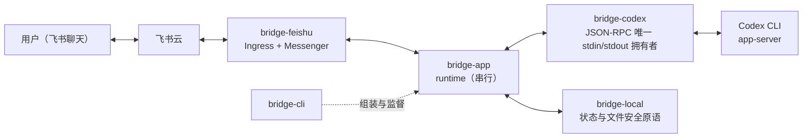
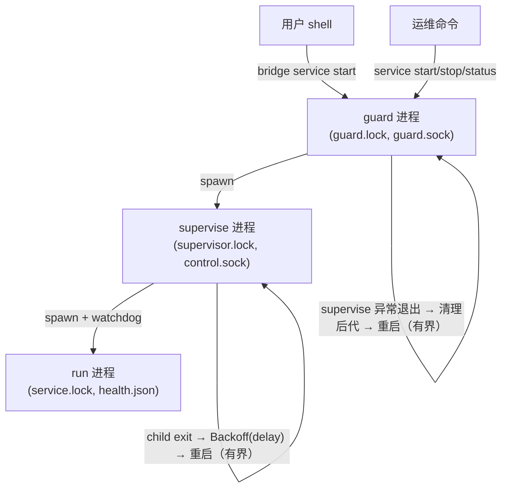
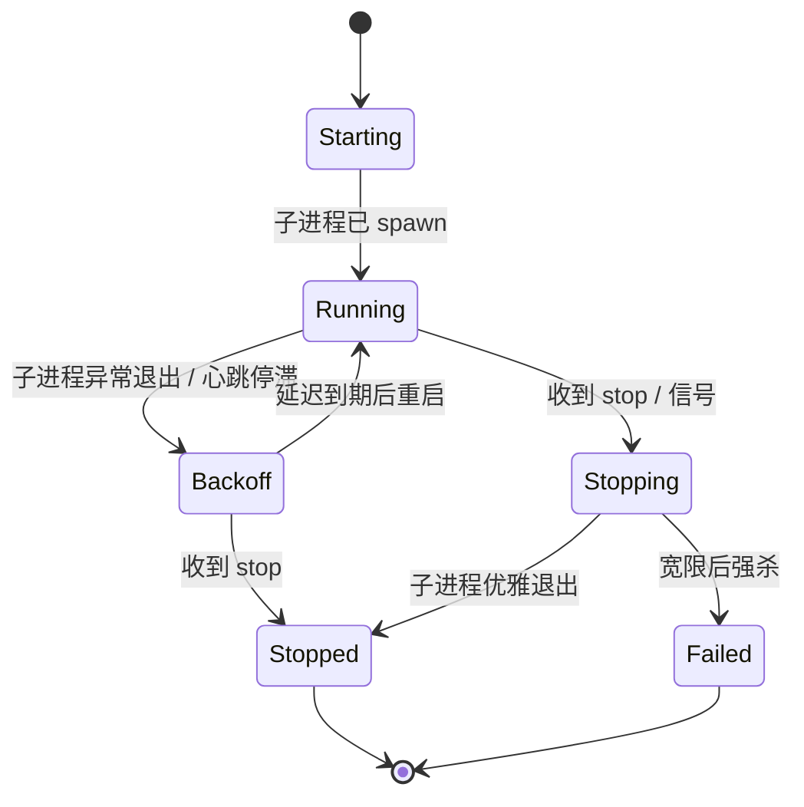
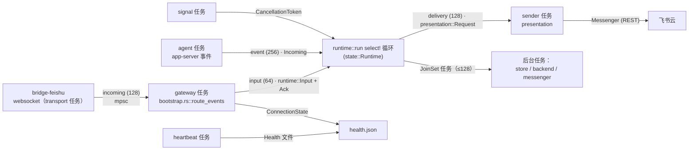

# 架构

本文描述当前实现。每个小节对应图上的一个框；图中的每个节点与边都能在代码里找到同名模块、类型或通道。运行时序图见 [runtime-flows.md](runtime-flows.md)，部署见 [deployment.md](deployment.md)，运维见 [operations.md](operations.md)。

## 系统上下文

六个生产 crate 的职责一句话各自可述：

- **bridge-core** — 共享命令、任务/会话标识与展示类型；无 IO。
- **bridge-feishu** — 飞书原生 WebSocket 帧、心跳/重连、代理、REST、卡片渲染与事件解码（ingress）。
- **bridge-app** — 授权、命令路由、调度、会话、审批/问答、Plan 流与结果呈现；只依赖端口（ports）。
- **bridge-codex** — Codex app-server 的 stdin/stdout JSON-RPC 唯一拥有者，并拥有 Codex 进程组。
- **bridge-local** — 版本化 JSON 状态、去重、工作区包含与文件安全原语（`safeio`）。
- **bridge-cli** — 装配一切：`guard → supervise → run` 进程链、健康发布、日志轮转、后代清理。

## 进程链与监督

监督状态机（`supervisor_state::Phase`，控制 socket 以 JSON `LivePhase` 回答）：

心跳看门狗只在最内层（supervise）运行：启动宽限 120 秒必须大于健康心跳间隔（10s）加新鲜度窗口（30s）加一轮探测；进度宽限 45 秒是心跳流动后的静默预算。

## 运行时数据流

一个前台 run 围绕串行 select 循环组成六个异步任务；箭头即有界通道（标注容量）或共享句柄，所有符号都真实存在于代码：

`state::Runtime` 持有六个状态组件（见下），按因果流把完成事件路由到 `jobs::{session,task,card}`。运行时模块文档里保留同一张 ASCII 拓扑图。

## 状态组件

`bridge-app/src/runtime/state.rs` 把运行状态分组为可命名的组件，每个组件拥有自己的字段与不变量：

| 组件 | 职责 | 关键不变量 |
|---|---|---|
| `Admission` 准入 | 白名单、配对限流、命令去重 | 输入恰好结算一次 `Ack`；丢弃即拒绝 |
| `TaskTrack` 任务轨 | 调度器、唯一活动执行、任务资源 | 变更门由获取它的链条在终态事件释放 |
| `CardBook` 卡片簿 | 卡片动作、视图、世代、刷新队列 | 所有点击走 `resolve_click` 唯一校验入口 |
| `Approvals` 审批 | 审批/问答交互与缓冲的协议上下文 | 未完成问答不提交；回传不确定即停止 |
| `SessionBook` 会话簿 | 目录选择、创建确认、归档积压 | 偏好在内存选择变更前持久化 |
| `Progress` 进度 | 与发送任务共享的预览节流 | 进度失败不重试、不吞掉最终回复 |

## 卡片授权模型

按钮令牌由 `runtime/tokens.rs` 唯一铸造（`panel-`/`cd-`/`approval-`/`plan-`/`card:` 五种格式，全部绑定进程 epoch）。一次点击要过五道校验（`CardBook::resolve_click`）：令牌存在、属于当前用户/聊天/目录、由这条消息送达、未过期、且停止类按钮的任务快照 `TaskSnapshot` 仍与任务轨一致。列表卡片（`CardKind::List`）点击后整卡失效并重发新面板；交互卡片一次性消费。

## 文件访问安全边界

`bridge-local/src/safeio.rs` 是唯一的文件安全原语模块（威胁模型：攻击者可投放符号链接或在打开与读取之间换路径，即 TOCTOU）。防御手段：用已持有的目录描述符逐组件 `openat` 并加 `O_NOFOLLOW`，替换链接会令打开失败而不是静默重定向。原语清单：`open_regular`（相对路径打开常规文件）、`open_directory`（从 `/` 走绝对目录）、`pinned_path`（经 `/proc/self/fd` 钉住目录，Linux-only）。

## 不变量（必须保持）

- 普通任务串行执行；目录、会话与偏好修改走调度器的空闲变更门。
- 任务目录在执行前捕获并重新校验。
- 消息准入先持久化认领，再做副作用；结果未知的已认领操作不自动重放。
- 审批与卡片动作限定于属主用户、聊天与当前任务/回合；未完成的问答不得提交。
- 目录创建可能在后续状态提交失败时留下已创建目录；运行时报告失败，不改选择、不自动删除。
- 凭据绝不写入 TOML 或日志；配置、状态、健康、日志与附件是分离的边界。

## 词汇表

| 概念 | 代码符号 | 图节点/边 |
|---|---|---|
| 准入回执 | `runtime::Ack`（Drop 即 NAK） | input (64) 边上的结算语义 |
| 输入 | `runtime::Input` | gateway → select 循环 |
| 完成事件 | `Done::{Session,Task,Card,Delivery}` | 后台任务 → select 循环 |
| 结果模型 | `Outcome`（Completed/Stopped/…） | Answer 请求与 tone 映射 |
| 任务快照 | `cards::TaskSnapshot` | 停止/计划按钮的绑定 |
| 卡片世代 | `CardBook.generations` | 目录/偏好失效后的版本号 |
| 变更门 | `Scheduler::begin_session_mutation` | 空闲才能改目录/会话/偏好 |
| 准入票据 | `AdmissionTicket` | 持久化认领的进行中凭据 |
| 活监督阶段 | `supervisor_state::LivePhase` | control.sock 的 JSON 应答 |
| 监督层 | `supervisor::Layer` | guard / supervise 两个框 |
| 安全原语 | `bridge_local::safeio` | 文件安全边界一节 |
| 协议快照 | `bridge-codex::protocol` | method→事件 映射的基线 |
