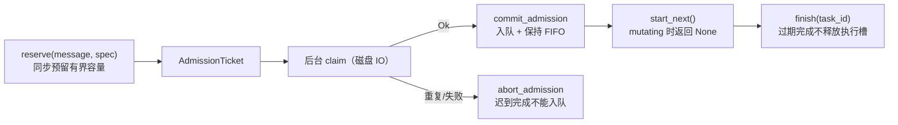

# bridge-app

应用层 crate：定义全部厂商无关端口、实现授权、命令路由、调度、会话、审批/问答、Plan 流与结果呈现。模块注释「Application boundaries and bounded serial admission. No vendor SDK types.」——本 crate 没有任何飞书/Codex/文件系统类型；所有厂商细节被隔离在三个适配 crate 中。运行时循环（`src/runtime/`）单独成篇：见 [bridge-app 运行时](bridge-app-runtime.md)。

依赖仅 `bridge-core`、`thiserror`、`tokio`、`tokio-util`、`tempfile`。

## 模块地图

| 文件 | 职责 |
|---|---|
| `src/lib.rs` | `MessageJournal` port、`AdmissionError`、`Scheduler`（有界串行准入器） |
| `src/ports.rs` | Agent 侧端口：`AgentBackend`、`TurnInput`、`TurnRef`、`Sandbox`、`BackendError` |
| `src/events.rs` | `Incoming`（`Notification(AgentEvent)` / `Request{request, reply}`） |
| `src/requests.rs` | `Approval`/`Question`/`AgentRequest`/`AgentReply`/`ReplyHandle` |
| `src/messaging.rs` | `Messenger` port 与 `DeliveryError` |
| `src/execution.rs` | 执行身份门 `Execution`（turn 绑定与 early 事件缓冲） |
| `src/interactions.rs` | 审批/问答唯一管理器 `Interactions` |
| `src/sessions.rs` | 会话生命周期用例函数 + `SessionStore`/`DurableJournal` port |
| `src/cards.rs` | 卡片、令牌、动作登记与视图世代（1075 行，最大模块） |
| `src/outcome.rs` | 终态枚举 `Outcome` / `Compaction`（纯数据） |
| `src/presentation.rs` | 唯一的文案/tone/状态映射 + 投递载荷 `Request` |
| `src/plans.rs` | Plan 完成后的实施要约 `Offer` |
| `src/directories.rs` | 目录创建确认 `Confirmations` + `DirectoryStore` port |
| `src/files.rs` | 文件端口（`LocalFiles`/`TaskFiles`/`ResourceFetcher`）+ 投递编排 `Deliveries` |
| `src/diagnostics.rs` | 元数据-only 诊断（23 种 `Event`、`Status`、`Sink`） |

## 端口总表（依赖边界的核心）

| trait | 方法面 | 实现者 |
|---|---|---|
| `AgentBackend`（ports.rs） | `models / threads / read_thread / start_thread / resume_thread / archive_thread / compact / start_turn / interrupt`，全部返回 `BackendFuture` | bridge-codex `CodexBackend` |
| `ReplyHandle`（requests.rs） | `fn reply(self: Box<Self>, AgentReply)` —— **一次性**：所有权在异步写之前被消费 | bridge-codex `Reply` |
| `Messenger`（messaging.rs） | `rich_output / send_panel / update_panel / send_text / upload` | bridge-feishu `FeishuRest` |
| `ResourceFetcher`（files.rs） | `download(ResourceRef, File)`（调用者拥有临时文件，成功后才提交） | bridge-feishu `FeishuRest` |
| `LocalFiles`（files.rs） | `scan / diffs / artifacts / stage_attachment / open_stable` | bridge-local `WorkspaceFiles` |
| `TaskFiles`（files.rs） | `bind_files / prepare_files / finish_files` | 本 crate `Deliveries`（编排） |
| `SessionStore`（sessions.rs） | `pair / clear_thread / preferences / set_preference / thread / bind / clear` | bridge-local `AsyncState` |
| `DirectoryStore`（directories.rs） | `propose_directory / create_directory / directory_preferences / validate_directory / inspect_directory / change_directory` | bridge-local `AsyncState` |
| `DurableJournal`（sessions.rs） | `claim(message) -> bool`（false = 重复，不是再次执行的许可） | bridge-local `AsyncState` |
| `MessageJournal`（lib.rs，同步） | `claim_message(&mut id) -> Result<bool>`（持久化前不得报成功） | bridge-local `JsonStore` |
| `Sink`（diagnostics.rs） | `write(&self, record, panic)` | bridge-cli `Log` |

关键数据类型：`Model{id, is_default}`、`ThreadSummary{id, title, directory, active}`、`Sandbox::{WorkspaceWrite, DangerFullAccess}`、`TurnInput{thread_id, directory, prompt, images, model, mode, sandbox}`、`TurnRef{thread_id, turn_id, epoch}`、`BackendError::{Disconnected, Uncertain, Incompatible, Rejected(i64)}`。

## Scheduler：有界串行准入器

由运行时单任务独占（不并发修改）。字段：`capacity`（64）、`queue`、`active`、`mutating`、`pending`、`next_admission`。



- `admit`（同步路径）顺序校验：空 id → `MissingId`；`mutating` → `SessionMutation`；容量满 → `Full`；有 pending → `Pending`；journal 判重复 → `Ok(false)`。
- `reserve` 把磁盘 IO 移出状态所有者：「持久化期间 stop/status 仍可用」；`drain_admissions` 保证磁盘乱序完成也维持准入 FIFO。
- **变更门**：`begin_session_mutation()` 仅在完全空闲（无 active、队列空、pending 空、未在变更中）时可取得；`end_session_mutation()` 释放。`begin_invalidation()` 是只排除 active 的弱化版本（运行期归档同步专用）。谁取门，谁的链条就在终态事件释放——这是 jobs/session.rs 的头号不变量。
- `cancel_queued(session)` 移除该会话全部排队/挂起任务（/stop 用）。

`AdmissionError` 变体与用户文案：`Full`（任务队列已满，请稍后重新发送）、`SessionMutation`（对话操作中，请稍后重新发送）、`MissingId`、`Pending`（该消息正在保存接收状态）、`Persistence(E)`（消息状态保存失败）。

## Execution：执行身份门

不是状态机枚举，而是「布尔 + 缓冲」构成的身份门：`{epoch, thread, turn: Option<TurnRef>, early: VecDeque<AgentEvent>, capacity, terminal}`。

- `event()`：`Archived/Started/FileChanges` 不做身份绑定；`Output/Plan/Finished` 按 `(epoch, thread)` 过滤——**无关身份的事件永不进入本执行的缓冲**；turn 未绑定时进 early 缓冲（容量 64，溢出 → `terminal = true` + `Err(Incompatible)`）；`Finished` 置 terminal。
- `bind()`：**恰好绑定一次**（terminal/已绑定/身份不符/turn_id 为空 → `Incompatible`），绑定后回放 early 缓冲。
- `accepts_request()`：「在 start 响应之前，请求可以等待但不得被批准」。
- `disconnect()`：「不确定的 RPC 失败绝不制造隐式重试路径」。

单元测试覆盖：start 响应前到达的 Finished 被缓冲并在 bind 时回放；旧 epoch 事件丢弃；缓冲溢出后不可重绑。

## Interactions：审批与问答的唯一管理器

每个条目单一所有者（收到卡片的同一 user+chat+directory，绑定仍在运行的 turn）。`Pending` 字段：`waiting_text`、`answers`（qid → 答案）、`question`（当前题索引）、`request`、`reply: Box<dyn ReplyHandle>`、`task`、`owner`、`deadline`、`card_dispatched`、`source`（最近一次交付卡片的 message id）。

规则（模块注释即不变量）：

- **容量与去重**：拒绝空 token、超过 `INTERACTIONS(32)`、重复 token，以及同一 turn+item 的第二个未决请求（重复请求有歧义，撤销先前的）。
- **先消费后写**：`approve()` / 问答完成时条目在任何异步写之前被移除——不确定的回复永远不会重新启用一个审批。
- **点击来源绑定**：按钮答案必须来自条目最近交付的那张卡（`pending.source`）；`answer_text` 要求 `index == question` 逐步推进；`/choice other` 且题允许自由文本 → `waiting_text`。
- **过期与陈旧**：`stale_tokens` 找出 deadline 已过或所属任务已死的 token；**过期条目在被移除前保持注册，保证「必需的拒绝」恰好发送一次**；`expire_turn` 立即到期（FileChange 快照歧义时撤销待审批）。
- **组完整性**：问答组任一题缺答案/答案为空 → `submitted: false`，**丢弃 handle，什么都不写**（包括关机时）；提交受 `BACKEND_REPLY_TIMEOUT(10s)` 约束，超时 → `Uncertain`（「不确定结果必须停止运行：协议状态无法区分已应用/未应用」）。

## sessions：会话生命周期用例

`DEFAULT_MODEL = "gpt-5.6-luna"`。核心函数（全部是无状态用例，状态在 port 后面）：

| 函数 | 行为 |
|---|---|
| `prepare(backend, store, task, images, sandbox)` | 「准备持久化状态但绝不启动 turn」：校验路径/用户 → 解析模型（task.model 优先，否则默认模型须在 models 列表）→ 有绑定走 `resume_thread`、无绑定走 `start_thread` → 校验 thread.id/目录一致 → `store.bind` 落盘 → 返回 `TurnInput`。**scheduler 必须先预留全局执行位** |
| `prepare_configured(...)` | 把 `preferences.model/plan` 覆盖到 task 副本再 `prepare`（「设置变更持有全局空闲门，排队任务不能改变模式」） |
| `start(...)` | `prepare` + `backend.start_turn`；不确定结果后绝不自动重试 |
| `prepare_compaction(...)` | 「重启后加载一个空闲 thread，不创建也不重绑」：要求已绑定、`read_thread` 校验（非 active、目录匹配）→ `resume_thread` → 再校验 |
| `resume / change_thread / list_entries` | resume 先 `read_thread` 校验再 `resume_thread` 再 `store.bind`；Archive/Unarchive 校验后调 archive 接口，归档成功才 `store.clear_thread`；列表按目录过滤 + `valid_thread_id` 过滤 + take(8)、标题截断 160 字符 |
| `change_preference(...)` | 模型 id 需非空、≤256 字符且在 `backend.models()` 中 |

`StartError` 变体：`NoSession`（当前目录没有已绑定会话，请先提问或使用 /resume 恢复会话）、`Reconcile`（归档状态结果不确定；请核对并修复本地会话绑定后再重启，不能直接重发任务）、`Storage`、`Backend`。`valid_thread_id`：非空、≤256、仅 ASCII 字母数字与 `-` `_`。

`SessionStoreError` 的 Display 恒为「状态保存或读取失败」（安全文案），类别 `StoreFailureKind::{Io, Format, Version, Locked, Uncertain, InvalidMessage}` 供运维。

## cards：令牌、动作与视图

- `CardToken(String)`：本进程铸造的不透明一次性卡片动作标识；`Click{token, source}` 是一次按钮点击（source = 交付消息标识）。
- `TaskSnapshot{next_task, active}`：stop/plan-action 按钮绑定的任务侧状态——发行时的任务计数器与活跃任务，不匹配即证明按钮早于当前执行，不得触发。
- `Actions(BTreeMap<CardToken, Action>)`：容量 1000；`Action{generation, user, chat, directory, source, deadline, command, stop_snapshot}`。`take(click, user, chat, directory, now, snapshot)` 一次性消费：五重校验全过才返回命令串并移除。`invalidate_approval/source/user` 与 `retain_plan` 提供批量失效。
- `Views(BTreeMap<String, CardView>)`：容量 1000，按交付消息 id 索引；`note` 追加文本、`next_update` 生成「按钮裁剪」更新（已消费/过期/快照陈旧的按钮移除；全空则提示重发命令）。
- **装配器**：`panel()` 是通用底座——每个按钮获得不透明令牌 `{panel-prefix}-{index}`（choice 恒 `"run"`），真实命令串登记进 `commands`；多按钮分组（导航/会话/设置/任务/更多），`/stop` 独立分隔且 `Destructive`。公开构建器：
  - `help`：9 按钮控制面板 + 完整命令说明。
  - `threads(entries, archived)`：会话列表（恢复/归档/取消归档 + 刷新），`CardKind::List`。
  - `models`：take(20)，过滤空/超长/控制字符，标注「已选择/桥接默认」。
  - `approval`：标题按 kind（命令执行/进程输入/文件修改/网络访问审批）；完整性规则——FileChange ≤20 项且 path/diff 非空、单字段 ≤4096 字节、正文 ≤24 KiB、控制字符拒绝；`grant_root` 存在 → 整体拒绝同意；同意按钮仅在完整且 `can_allow` 时渲染，**拒绝按钮恒存在**；反引号围栏动态加长保留字面 Markdown。
  - `question`：第 i/n 题卡片，选项按钮 + 「其他／自行回答」；`question_supported` 校验选项 ≤20、文本总量 ≤16000。

## outcome 与 presentation

`Outcome`（纯数据）：`Completed`、`Stopped`、`BridgeStopped`、`Failed{detail}`、`PrepareFailed{detail}`、`StartUnknown{detail}`、`Compact(Compaction)`、`NotStarted{label}`；`Compaction::{Completed, Stopped, Failed{detail}, PrepareFailed{detail}}`。模块注释：「任何地方都不得通过匹配消息文本来分类」。

`presentation` 是把 `Outcome` 变成用户可见措辞、卡片 tone 与诊断状态的**唯一位置**：

- `label()` 全部固定文案（「执行完成」「任务已停止」「桥接已停止；未完成任务不会自动重跑。」…，全表见 [运行时序图](../runtime-flows.md)）。
- `tone()`：Completed→Success；Stopped/BridgeStopped→Warning；三类失败→Error；Compact/NotStarted→Info。`finished_status()`：仅 Completed 记 `Status::Ok`。
- `Request`（delivery 通道载荷）：`Text(chat, text)`、`Answer{task, chat, outcome, body, truncated}`、`Progress{task, chat, text}`。
- `markdown_parts`：按 5500 字节分片（UTF-8 边界安全），跟踪 ``` 与 ~~~ 围栏，被切开的代码块在下一片补关闭并重开（含语言）。
- `Presentation` 状态：`preview: Option<(chat, MessageId)>` 与 `failed_task`——同任务之前投递失败则跳过后续预览（不重试），但最终回复仍按分片发送（卡片失败回退纯文本）；预览面板在答案发出前改题为「本轮已结束，完整回复见后续消息」。

## plans / directories / files / diagnostics

- **plans**：`Offer{task, thread, text, token, sent, deadline}`——「一份完成且完整保留的计划是实施要约的唯一来源」。卡片三按钮：确认并实施（`/plan-action {token} implement`）、清空上下文后实施（`fresh`）、继续讨论计划（`stay`）。
- **directories**：`Confirmations` 每用户仅一份待确认（`insert` 先 `invalidate(user)`）、容量 100、`get` 校验 user+chat+current+未过期、`expire` 输出过期项。`DirectoryView{text()}` 生成 /cd 引导文案。
- **files**：数据模型 `FileKind{Ignore, Text, Artifact}`、`Limits`（默认 200 文件 / 256 KiB 文本 / 10 000 条目 / 20 000 diff 字符）、`Entry`（bytes/modified/text/skipped/digest）、`Snapshot{files, complete}`、`FileDiff`、`StageRequest`。常量 `ARTIFACT_BYTES = 20 MiB`、`ARTIFACTS_PER_TASK = 10`。`Deliveries`（实现 `TaskFiles`）编排：
  - `bind_files`：thread id 必须 `[A-Za-z0-9_-]`（generated 目录共享，只有 thread 作用域子目录可成为成果）；扫描 `{generated}/{thread}` 为基线。
  - `prepare_files`：附件 >10 拒绝；逐个 tempfile → `download`（45s 超时）→ 大小校验 → `spawn_blocking stage_attachment` → prompt 追加「用户附件（作为数据读取）：{path}」、图片另进 `images`；最后扫描工作区基线。
  - `finish_files`：after 扫描 + diffs（diff_chars 4000）+ artifacts 候选 + 生成图目录 png/jpg/jpeg/gif/webp 候选；逐 diff 发面板（15s，失败回退文本）；候选按 digest 去重、超限计入 `omitted`；`open_stable` 私有句柄后 `upload`（30s）；汇总文本注明「另有 n 项因上限未发送」与扫描不完整提示。
- **diagnostics**：「元数据-only。调用者无法传入 prompt、答案或远端错误。」23 种 `Event`（RuntimeStarted、Connection*、TaskPrepared/Started/Finished、Files*、Question*、AnswerReturned、DeliveryFailed、CardFailed、Overloaded、HealthWriteFailed、ArchiveReconciled、Reconnect、HeartbeatTimeout、Panic、RuntimeExit…）；`record` 生成单行 JSON `{event,status,unix_ms,pid,task,count}`，task 只接受内部生成的 id（≤64 字节、仅数字与 `:`）；`startup_record` 限静态 stage 名（≤32、小写+`_`）；sink 写失败只向 stderr 打一句警告，绝不 panic。

## 单元测试一览

| 模块 | 数量 | 覆盖要点 |
|---|---|---|
| lib.rs（Scheduler） | 6 | 满队列/持久化失败、FIFO+去重+过期完成、失效与 pending 次序、mutation 拒绝不认领、乱序磁盘完成保序、取消不入队 |
| execution.rs | 2 | early 缓冲回放、旧 epoch 与溢出不可重绑 |
| interactions.rs | 8 | 风暴上限与 turn+item 去重、外来所有者不消费、先消费后写、不确定回复与不完整答案不提交、逐题推进、过期一次报告、turn 撤销、死 turn |
| cards.rs | 7 | 审批字面渲染与不可同意条件、视图更新仅移除已消费按钮、目录失效与陈旧 stop、plan 问题无跳过、列表回退与导航 |
| presentation.rs | 5 | 预览→结束→完整答案、进度失败停发但最终回退、长 Unicode/围栏重开、~~~ 围栏 |
| directories.rs | 1 | 确认需所有者+chat+目录+未过期 |
| diagnostics.rs | 3 | 失败/缺失 sink 不 panic、startup 有界、payload 拒绝 |
