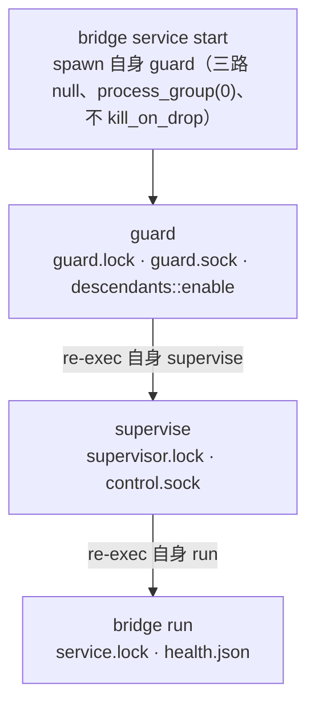

# bridge-cli

组合根与运维面：clap 子命令、`bridge.toml` 配置模型、`guard → supervise → run` 进程链、两层监督、健康与日志、凭据交互、后代清理。唯一产品二进制 `bridge`（`default-run`）。

## 模块清单

| 文件 | 职责 |
|---|---|
| `src/main.rs` | clap 子命令树与分发 |
| `src/lib.rs` | 配置模型（serde `deny_unknown_fields`）与校验 |
| `src/bootstrap.rs` | 前台 run 的完整装配（五任务 + 三通道 + route_events 网关） |
| `src/supervisor.rs` | 两层监督循环、退避、心跳看门狗、子进程管理 |
| `src/supervisor_state.rs` | 监督阶段快照（snapshot.json）与 LivePhase |
| `src/service_control.rs` | 控制 socket 协议与 service start/stop/restart/status |
| `src/health.rs` | health.json、心跳任务、状态 Report 与中文 display |
| `src/logging.rs` | 轮转 JSONL 诊断日志 |
| `src/credentials.rs` | 凭据校验、隐藏输入、`--print` export 语句 |
| `src/setup.rs` | `config init` 生成私有配置 |
| `src/descendants.rs` | Linux child-subreaper 后代进程清理 |

## 子命令树（main.rs）

```text
bridge（飞书与 Codex 的原生桥接服务）
├── guard       --config <路径>                 外层守护：监督器异常退出后清理后代并有界重启
├── service     --config <路径> <start|stop|restart|status>
│                                               后台启动、停止、重启或查询监督阶段
├── supervise   --config <路径>                 前台监督桥接，异常退出后有界退避重启
├── status      --config <路径>                 查询运行锁与最后记录的连接状态，不连接飞书
├── run         --config <路径>                 前台运行桥接（run 需要 [feishu] 配置与凭据）
├── config
│   ├── init    --output <路径>（默认 bridge.toml）--root --cwd --state-dir <必选>
│   │           [--allowed-user <id>]…（可重复）[--danger-full-access]
│   │                                           生成私有配置：不覆盖文件、不写凭据、不启动服务
│   └── check   --file <路径>                   检查显式 TOML 配置；不读 .env、不连外部服务
├── credentials --file <路径> [--print]         按配置声明的环境变量校验凭据；交互终端隐藏输入；
│                                               --print 输出缺失凭据的 export 语句供脚本 eval
└── check-command <文本>                        验证文本命令语法，不执行
```

`service`/`status` 的实现共用 `print_status`：读锁与两份监督快照，若监督器在跑再问控制 socket 的 `LivePhase`，最后渲染 `health::display` 三行中文。所有错误统一 `错误：{e}` 退出码 1。

## 配置模型（lib.rs）

```rust
Config {
    workspace: { root, cwd, state_dir },            // 全部必填
    access:    { mode: restricted|open, allowed_open_ids: 默认空, pairing_code_env: 可选 },
    codex:     { executable, args, sandbox: workspaceWrite|dangerFullAccess },
    feishu:    Option<{ app_id_env, app_secret_env, proxy_env }>,   // run 必需
}
```

`read` 只读显式 TOML 文件（「Does not source .env or create files」）。`validate()` 按序校验并给出固定文案：

1. root/cwd/state_dir 必须绝对路径 →「工作区、初始目录和状态目录必须为绝对路径」
2. `Workspace::new(root)` →「工作区根目录无效」
3. `resolve_existing(cwd, cwd)` →「初始工作目录无效或越出工作区」
4. 白名单空 ID →「白名单不能包含空用户 ID」；env 名（`[A-Za-z0-9_]`）逐个校验
5. 缺 `[feishu]` →「缺少 [feishu] 配置段」
6. restricted 且白名单空且无 pairing_code_env →「restricted 模式需要白名单或 pairing_code_env」
7. codex.executable/args 为空 →「Codex executable 和 args 不能为空」

`Sandbox` 与 bridge-app 的 `ports::Sandbox` 等值转换。

## 进程链与 bootstrap 装配



`bootstrap::run(config)` 的装配顺序（每步失败都先 `startup_record(stage)` 记录有界启动诊断再退出）：

1. 读取 `feishu` 段与凭据环境变量（缺失 →「凭据环境变量不可用」）。
2. **App ID 全局锁**：目录 `$HOME/.feishu-codex-bridge`（可被 `CODEX_SERVICE_GLOBAL_STATE` 覆盖），锁文件名 = App ID 的 SHA-256 前 24 个十六进制字符；冲突 →「同一飞书 App ID 已有运行实例」。
3. `Health::start`（打开 runtime 目录 + service.lock）→ `Diagnostics`（runtime/events.jsonl）→ panic hook（记 `Panic/Failed`，**不含 payload**）→ `RuntimeStarted`。
4. `JsonStore::open(state_dir)`；合并配置白名单与持久化 `allowed_open_ids`；读取可选配对码（非法 →「配对码需为 16–256 字节且不含空白」；restricted 且无白名单无配对 → 拒绝）。
5. `AsyncState::new(json).with_pairing(code)`；`FeishuRest::new(app_id, secret, proxy, 20 MiB)`。
6. epoch = UNIX 纪元纳秒（回退 PID）；canonicalize root/cwd；`websocket::Client::new`。
7. `AppServer::spawn(codex.executable, codex.args, directory, epoch)` → `CodexBackend`。
8. **归档对账**：60 秒超时内 `bound_threads → archived_bindings → clear_archived_bindings`；失败 →「归档状态核对失败，未启动业务接收」并 shutdown。
9. spawn 五任务（heartbeat 10s、transport、gateway、agent、signal）+ 当前任务跑 `runtime::run`；通道 incoming 128 / input 64 / event 256（delivery 128 在 runtime 内创建）。
10. 收尾：cancel → 逐个 join → `signal.abort()` → `health.finish`（成功条件：runtime Ok 且 transport/gateway/heartbeat/agent 全部正常）。

`route_events` 网关：连接事件映射为诊断（ConnectionStarting/Established/Reconnecting）+ health Phase 并写 health.json（写失败 → unhealthy + cancel）；业务事件 `into_runtime_input()` 后 `try_send` 进 input 通道——**满即丢弃并记 `Overloaded` 诊断，绝不阻塞 transport**（有界准入）。

`Deliveries::new(diagnostics, WorkspaceFiles, messenger, messenger)` 链式 `.excluding([state_dir])` 与 `.generated_images(...)`（生成图目录取 `CODEX_GENERATED_IMAGES` > `CODEX_HOME` > `$HOME/.codex` 再拼 `generated_images`）。

## 两层监督（supervisor.rs + supervisor_state.rs）

### 存活判定：只看锁，不看 PID

`is_running` = guard.lock 或 supervisor.lock 被 `try_lock_exclusive` 占用（`WouldBlock` 即运行中）；锁文件必须以 `NOFOLLOW|NONBLOCK` 打开、普通文件且 `nlink == 1`（防符号链接/硬链接重定向）。

### 常量

| 常量 | 值 | 说明 |
|---|---|---|
| 退避序列 | `(2 << (n−1)).min(30)` → 2、4、8、16、30… | 失败 >10 次放弃（「bridge repeatedly exited; restart budget exhausted」） |
| `RETRY_DELAY_CAP_SECS` | 30 | 单次退避上限；心跳停滞路径固定 30 秒 |
| `STABLE_RUN` | 60 秒 | 运行短于此不重置预算（supervise 层传真实运行时长，guard 层传 0） |
| `STARTUP_GRACE` / `PROGRESS_GRACE` | 120 秒 / 45 秒 | 看门狗宽限：从未收到心跳按启动宽限判定，收到过按进度宽限 |
| `WATCHDOG_PROBE` | 5 秒（单次探测限时 2 秒） | **仅内层 supervise 启用**；心跳必须属于当前子进程 pid |
| `STOP_GRACE_BRIDGE` / `STOP_GRACE_SUPERVISOR` | 20 秒 / 45 秒 | SIGTERM → 宽限 → SIGKILL |

### 阶段快照与控制应答

`Phase::{Starting, Running, Backoff, Stopping, Stopped, Failed}`；`LivePhase{phase, retry_delay_seconds}`（delay 仅 Backoff 有意义）。`Recorder` 每次 publish 写 `snapshot.pending`（0600、NOFOLLOW）→ rename `snapshot.json` → 目录 fsync，并追加一行到 events.jsonl；`Drop` 未 finish 则尽力 publish `Failed`。读取上限 4096 字节，version ≠ 1 拒绝。

guard 层快照在 `state/guard/runtime/supervisor/`，supervise 层在 `state/runtime/supervisor/`——`stop` 与 `status` 按 guard 是否在跑选择读取位置。

### supervise 循环

spawn 子进程（re-exec 自身 + `child_action()`，stdin null、stdout/stderr 继承、`kill_on_drop(true)`、独立进程组）→ publish Running → `select!{ biased; cancel / child.wait() / 看门狗 }`：

- cancel → publish Stopping → 有宽限停止 → `descendants::clean()`。
- 子进程退出 → `descendants::clean()` → 成功返回；失败算 Backoff → publish + stderr `{"event":"supervisor_retry","delay_seconds":N}` → 可取消的 sleep 后重启。
- 看门狗触发 → stderr `{"event":"heartbeat_stalled"}` → 停止子进程 → 清理 → Backoff 30 秒 → 重启。

## service_control.rs：控制协议

控制 socket 单字节命令 + 单 JSON 应答（单连接 1 秒限时；客户端总超时 3 秒、响应上限 4096 字节）：

| 命令 | 字节 | 应答 |
|---|---|---|
| Phase | `s` | `{"phase":"backoff","retry_delay_seconds":5}` 或 `{"phase":"running"}` |
| Pid | `p` | `{"pid":<n>}`（start 用它确认 socket 应答者就是自己启动的子进程） |
| Stop | `x` | cancel 触发 + `{"phase":"stopping"}` |
| 未知 | 其他 | `{}` |

- `start`：is_running → 拒绝；spawn guard 后 10 秒内轮询「子进程存活 + guard.sock 的 Pid == child.id()」；失败只在 PID 一致时才发 Stop（**绝不误杀已有监督器**），再等 30 秒。
- `stop`：发 Stop 且必须收到 stopping 确认（「stop not acknowledged」）；60 秒内每 100ms 轮询锁释放；读快照确认 phase == Stopped（否则「supervisor did not record a clean stop; no restart performed」）。
- `restart` = 同一 `control.lock` 保护下 stop + start。
- CLI 不直接对后代发信号——清理全部经由 supervisor/guard 自身（TERM → 宽限 → KILL → `descendants::clean()` → 快照 finish → socket 删除 → 锁随进程退出释放）。

## health.rs / logging.rs

- health.json：`{version:1, pid, started_unix_ms, updated_unix_ms, phase, heartbeat_unix_ms?}`；Phase ∈ `Starting/Connected/Reconnecting/Stopped/Failed`（飞书连接维度）。写入与快照同样原子（pending → rename → 目录 fsync），读取上限 4096 字节。
- 心跳：`heartbeat` 任务每 10 秒 `pulse()`（MissedTickBehavior::Skip）；新鲜窗口 30 秒；写失败发 `HealthWriteFailed` 并 cancel runtime；`finish` 后不再写；`Drop` 未 finish 写 Failed。
- `display` 三行格式：`桥接状态：…\n飞书连接：…\n自动恢复：…`（如 Backoff →「将在 {seconds} 秒后重试。」）；有意不暴露 PID 与时间戳。
- 日志：`Log(Mutex<Writer>)` 追加写 events.jsonl（0600、NOFOLLOW、非普通文件或 nlink≠1 拒绝）；单条上限 4096 字节且不得含换行；2 MiB 轮转、倒序 rename 保留 3 份备份；轮转失败后 file = None（后续写入报错而不是丢数据）；panic 路径用 `try_lock`（拿不到 →「log busy during panic」，绝不阻塞）。

## credentials.rs / setup.rs / descendants.rs

- **credentials**：按配置声明的 env 名校验（有值跳过，否则交互 `read_hidden`——termios 关 ECHO，无终端则普通读取）；配对码规则 16–256 字节无空白；`state_allows_pairing_skip` 窥探 state.json 的 `allowed_open_ids`（已有配对用户则配对码可选）；`--print` 输出 `export NAME='value'`（单引号转义）+ 配对码存在时追加 `BRIDGE_RUST_PAIRING_PRESENT=1`。任何值都不回显到错误信息。
- **setup（config init）**：三个路径必须绝对；root/cwd canonicalize；mode 恒 restricted（users 空 → `pairing_code_env = FEISHU_PAIRING_CODE`）；codex 默认 `codex app-server --enable collaboration_modes`；`--danger-full-access` 切 sandbox；validate 后 NamedTempFile（0600）+ `persist_noclobber`（**拒绝覆盖**）+ 父目录 fsync；不创建 state 目录、不写凭据、不启动服务。
- **descendants**：`enable()` 注册 child-subreaper（孤儿子代被本进程收养而非 init）；`clean()` 在 5 秒 deadline 内循环：枚举子进程（/proc children，回退 status 扫描）→ `pidfd_open` → **重新校验所有权**（防 PID 复用）→ `pidfd_send_signal(KILL)`（基于描述符，PID 复用也不会误杀）→ waitpid 收割；超时 →「descendant cleanup incomplete; refusing restart」。宁可报错也绝不声称清理完成。

## 集成测试（tests/）

| 文件 | 覆盖 |
|---|---|
| `app_lock.rs` | App ID 全局锁排除第二实例 |
| `approval_runtime.rs`（15 个用例） | 真实 runtime 全链路：配对不把码发给 Codex、审批一次性决策、Plan 三选一只执行一次、过期/换线程/投递失败/不确定回传的安全降级 |
| `archive_reconciliation.rs` | 启动对账分页扫描与一次原子清除；不完整/非法扫描或提交失败都保留绑定 |
| `card_runtime.rs` | 渲染卡片点击经真实 runtime 往返：owner/source 绑定、确认卡建目录、按钮一次性失效 |
| `cli_credentials.rs` | 真实二进制：env 名、隐藏输入、export 行、不回显值 |
| `cli_startup.rs` | 启动失败的有界记录（stderr JSON）；原始错误内容（secret 标记）绝不回显 |
| `cli_status.rs` | status 输出；socket 卡死时 3 秒超时不 panic；LivePhase 渲染 |
| `config.rs` | restricted 校验、sandbox 拼写拒绝、退役字段与 migrate 命令被拒 |
| `directory_switch.rs` | 目录创建确认一次性、symlink/越界拒绝、按目录持久化与保存失败保留旧值 |
| `files_runtime.rs` | 附件仅下载一次并进入 turn、投递阻塞下一任务、流式输出聚合 |
| `files_staging.rs` | feishu-inbox 落盘、diff 面板、`.env`/`target` 不外泄、失败不发布半成品、20 MiB 上限 |
| `scripts.rs` | fake 二进制驱动 setup.sh/start.sh 的精确命令行与 secret 不泄漏 |
| `session_archive.rs` / `session_reset.rs` / `session_resume.rs` / `session_start.rs` | 归档先远端后本地一次提交；/new 绝不触达 Codex；resume 先校验后绑定；绑定先落盘再 start_turn |

## 常量速查

| 常量 | 值 | 常量 | 值 |
|---|---|---|---|
| incoming/input/event | 128 / 64 / 256 | control 超时/响应上限 | 3 秒 / 4096 字节 |
| 退避 | 2→30 秒封顶，>10 次放弃 | start/stop 轮询 | 10 秒 / 60 秒（100ms） |
| `STARTUP/PROGRESS_GRACE` | 120 / 45 秒 | 心跳 | 10 秒间隔、30 秒新鲜 |
| `STOP_GRACE` | run 20 秒 / supervise 45 秒 | 日志 | 4096 字节/条、2 MiB × 4 |
| `STABLE_RUN` | 60 秒 | 快照/健康读取上限 | 4096 字节 |
| 配对码 | 16–256 字节 | 权限 | 目录 0700、文件/日志/socket 0600 |
