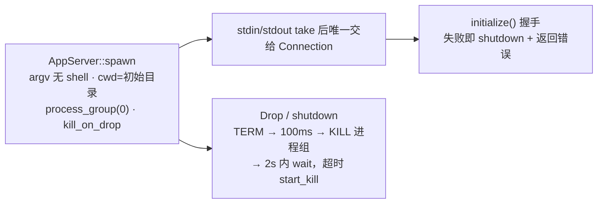

# bridge-codex

Codex app-server 适配层：进程所有权（spawn 并独占管理 `codex app-server` 子进程）、JSONL 双向传输与请求关联、把 Codex CLI 0.153.4 的具体 RPC 形状映射到厂商无关端口（`AgentBackend` / `AgentEvent` / `AgentRequest`），并以版本化 schema 快照 + fixture 做离线契约测试。设计红线：vendor JSON 值不越过 bridge-app 边界；升级快照是显式维护步骤（见 [工具链](tooling.md) 的 `codex-schema`）。

## 模块清单

| 文件 | 职责 | 关键导出 |
|---|---|---|
| `src/lib.rs` | JSON-RPC envelope 边界 | `RpcId`、`Envelope`（4 变体）、`DecodeError`、`decode` |
| `src/process.rs` | 子进程 spawn/退出/终止，事件泵 | `AppServer` |
| `src/transport.rs` | JSONL 读写循环、请求 id、pending 关联 | `RpcClient`、`Connection`、`RpcError`、`ServerEvent` |
| `src/backend.rs` | 实现 `AgentBackend`；归档核对；`turn_params` 序列化 | `CodexBackend` |
| `src/events.rs` | 服务端通知 → `AgentEvent` 映射 | `notification()` |
| `src/requests.rs` | 服务端请求解码与一次性回传 | `prepare()`、`Reply`、`decode` |
| `src/permissions.rs` | （私有）权限 overlay / 网络上下文渲染 | `Notice{text, can_allow}` |
| `src/protocol.rs` | 快照基线常量与目录定位 | `CODEX_SCHEMA_BASELINE`、`SCHEMA_ROOT`、`FIXTURE_ROOT` |

## 进程所有权（process.rs）

- `AppServer { connection, child, group }`：stdin/stdout 被 `take()` 后**唯一**交给 `Connection`，crate 内没有第二条读写路径；stderr 直达 null。
- 子进程独占进程组（`process_group(0)`），终止不会波及桥接进程自身所在组；`Drop` 对残留进程组补发 SIGKILL。
- epoch 由 bridge-cli 传入（UNIX 纪元纳秒，回退 PID），随连接构造传递——所有协议标识都带 epoch（见下）。
- `next_event()` 是单消费者事件泵：epoch 不匹配 → `Incompatible`；通知经 `events::notification` 过滤；请求经 `requests::prepare` 得 `(AgentRequest, Box<dyn ReplyHandle>)`；Response/Error 流到这里说明无主 → `Incompatible`。
- `is_disconnected()` 用 `try_wait()` 判断；已退出则对残留组补 SIGKILL。

## 传输（transport.rs）：行分隔 JSONL

帧格式是**换行分隔 JSON**（非 LSP 头），写侧 `to_vec + '\n'`，读侧 `LinesCodec`，单帧上限 8 MiB，超限直接 `RpcError::Protocol` 断链。

- **请求 id**：`RpcId::String("{epoch}:{n}")`，`n` 来自 AtomicU64——epoch 前缀天然隔离新旧连接，旧连接的应答不可能命中新连接的 pending 表。
- **pending 关联**：`Pending = Arc<Mutex<HashMap<RpcId, oneshot::Sender<…>>>>`；`RequestGuard` 在 drop 时移除条目，被取消的任务不泄漏；读循环按 id（而非到达顺序）路由，`Error` 帧 → `RpcError::Remote{code}`（缺省 −32603）。
- **有界**：出站通道 32、事件通道 256、并发信号量 32；事件通道满即 `RpcError::Overloaded`（**fail-closed，绝不丢事件**）。
- **超时**：读写排队与 flush 全部在 deadline 内完成（`bounded()` = biased select：取消 → Closed，`timeout_at(deadline)`）；notify/reply/reject 发送超时 5 秒；writer 单帧 flush 上限 5 秒。
- `reject(epoch, id)` 回固定 `{"code":-32602,"message":"Unsupported or invalid bridge request"}`——错误文本不含方法名或载荷（防信息泄漏）。`reply` 保持服务端 id 原样。
- `Connection::shutdown()`：cancel 后依次 await 读/写任务，保留首个错误。

`RpcError` 变体（Display 全中文）：`Closed` / `Timeout`（「操作可能已经执行，不可自动重试」）/ `Protocol` / `Overloaded` / `StaleConnection` / `Remote{code}`。

## Backend：AgentBackend 的实现

`CodexBackend { rpc: RpcClient }`，错误映射 `From<RpcError> for BackendError`：`Timeout→Uncertain`；`Closed|Overloaded→Disconnected`；`Protocol|StaleConnection→Incompatible`；`Remote→Rejected(code)`。

| `AgentBackend` 方法 | RPC | 参数/响应要点 |
|---|---|---|
| `models()` | `model/list` | `data[]` 取 `id`、`isDefault` |
| `threads(directory, archived)` | `thread/list` | `{"cwd":[dir],"limit":20,"sortKey":"updated_at","sortDirection":"desc"}` |
| `read_thread(id)` | `thread/read` | `includeTurns:false` |
| `start_thread(directory)` | `thread/start` | `{"cwd":dir}` |
| `resume_thread(id, directory)` | `thread/resume` | `{"threadId","cwd"}` |
| `archive_thread(id, archived)` | `thread/archive` / `thread/unarchive` | 二选一 |
| `compact(id)` | `thread/compact/start` | 结果必须是 object |
| `start_turn(input)` | `turn/start` | 见下；响应取 `turn.id`，返回 `TurnRef{thread_id, turn_id, epoch}` |
| `interrupt(turn)` | `turn/interrupt` | 发送前校验 `turn.epoch == rpc.epoch()`（旧连接的中断被拒） |

所有 `call()` 统一 **30 秒超时**。`TurnRef` 的三元组身份（thread + turn + epoch）贯穿 events/execution/interactions——运行时的执行身份门靠它判定事件归属。

### turn/start 参数（turn_params）

生产序列化器即契约，被 fixture 锁定（`fixtures/codex/0.153.4/turn-start-{plan,default}.json` 逐字段相等）：

- 输入数组：首元素 `{"type":"text","text":prompt}`，随后每个图片 `{"type":"localImage","path":…,"detail":"auto"}`；model/thread_id 非空、目录与图片必须绝对路径，否则 `Incompatible`。
- `approvalPolicy: "on-request"`——**桥不预授权，一切副作用走审批**。
- `collaborationMode: {"mode":"plan"|"default","settings":{"model":…}}`（按 `ExecutionMode`）。
- sandbox 映射：`WorkspaceWrite → {"type":"workspaceWrite","writableRoots":[directory],"networkAccess":false}`；`DangerFullAccess → {"type":"dangerFullAccess"}`（只能显式配置选择）。

### 归档核对辅助

`archived_bindings(bindings)` 分页扫全量归档线程：`MAX_PAGES=100`、`MAX_PAGE_SIZE=100`、游标长度 ≤4096（环检测 fail-closed）；`ARCHIVED_SOURCE_KINDS` 完整列举 schema 的 10 个 `sourceKinds`（`cli, vscode, exec, appServer, subAgent, subAgentReview, subAgentCompact, subAgentThreadSpawn, subAgentOther, unknown`）——注释强调列表必须跟踪 schema 而非样例，漏项会把归档线程误判为活跃。每个 id 都经 `valid_thread_id` 校验。

## 事件映射（events.rs）

`notification(epoch, method, params) -> Option<AgentEvent>`：

| 通知 method | 产出 | 备注 |
|---|---|---|
| `item/started` | `FileChanges{turn, item, changes}` | 仅 `item.type == "fileChange"`；kind 必须是 `add\|delete\|update`；单 turn 上限 20 条、16 KiB（超限清空该 item 的 diff） |
| `turn/started` | `Started{turn}` | `status` 必须 `inProgress`，否则 `Incompatible`——执行门的绑定点 |
| `item/agentMessage/delta` | `Output{turn, item, delta}` | 流式预览 |
| `turn/completed` | `Finished{turn, outcome}` | `completed→Completed`、`failed→Failed{message,details}`、`interrupted→Interrupted`，其他拒绝 |
| `item/completed` | `Plan{turn, item, text}` | 仅 `item.type == "plan"` |
| `thread/archived` | `Archived{epoch, thread}` | 本地绑定须清除 |
| 其他 | `Ok(None)` 跳过 | 注释强调：忽略未知**通知**绝不意味着可忽略未知**请求** |

## 服务端请求与回传（requests.rs + permissions.rs）

`decode(method, params)` 把三类服务端请求解码为类型化 `AgentRequest`：

| method | 解码为 | 必填校验 |
|---|---|---|
| `item/commandExecution/requestApproval` | `RequestKind::Approval{kind: Command/WriteStdin}` | `startedAtMs` 必须存在 |
| `item/fileChange/requestApproval` | `RequestKind::Approval{kind: FileChange}` | 同上 |
| `item/tool/requestUserInput` | `RequestKind::Questions{blocking, questions}` | `isBlocking` 与非空 questions；题数 ≤ `MAX_QUESTIONS(32)`；id 唯一 |
| 其他 | `Incompatible` + `rpc.reject` 固定 −32602 | —— |

**can_allow 判定**（安全核心，bridge-app 的审批卡据此决定是否渲染同意按钮）：

- `environmentId` 存在（远程执行环境，桥无法表示）→ 不可同意。
- `grantRoot` 存在（会话级目录授权）→ 不可同意。
- 权限 overlay 与网络上下文必须可完整展示：read/write 列表与 entries 各 ≤100 条、渲染文本 ≤4096 字节；未知 special 目标仍渲染中文说明但不可同意。
- 命令审批还要求 `availableDecisions`（若存在）含 `accept` 且**必须**含 `decline`——无法拒绝的请求没有安全回复路径，直接 `Incompatible`。

**回传**（`Reply` 实现 `ReplyHandle`，一次性消费）：

- 审批：`Approve(allow)` → `{"decision":"accept"|"decline"}`；`allow == true` 而 `!can_allow` 被拒。schema 中存在的 `acceptForSession`/`acceptWithExecpolicyAmendment` **故意不可达**（测试锁定）。
- 问答：`Answers(BTreeMap<qid, Vec<String>>)` → `{"answers":{qid:{"answers":[...]}}}`；包含未知 qid 拒绝；未回答的题输出空数组。
- `prepare` 时 epoch 不匹配即 `Incompatible`（不产生任何线上帧，测试验证）；解码失败先 `reject` 再把错误上抛。

`permissions.rs`（私有模块）负责把 `additionalPermissions` overlay 与 `networkApprovalContext` 渲染为中文卡片文本：`Target` 支持 `Path | GlobPattern | Special{Root|Minimal|ProjectRoots|Tmpdir|SlashTmp|Unknown}`；所有值经 `literal()` JSON 转义，防止换行/Markdown 伪装成标签；`globScanMaxDepth == 0`、超长、未知字段一律不可同意。

## 协议快照

- `CODEX_SCHEMA_BASELINE = "0.153.4"`（src/protocol.rs）；快照目录 `schemas/codex/0.153.4/`（9 个 draft-07 schema + `manifest.json`，manifest 逐文件 SHA-256 锁定并记录生成命令 `codex app-server generate-json-schema --experimental --out <dir>`）；fixture 目录 `fixtures/codex/0.153.4/`（`turn-start-plan/default.json`、`server-requests.json` 5 个用例）。
- 生产代码不含 jsonschema 依赖（仅 dev）：运行期产出的 JSON（turn_params、审批 reply）在测试里对照 pinned schema 校验；快照目录本身的完整性由 `cargo xtask codex-schema check` 离线校验。
- 「快照升级了但常量没改」会被测试抓住：目录名与 `manifest.json["cli_version"]` 都必须等于 `CODEX_SCHEMA_BASELINE`。

## 常量速查

| 常量 | 值 | 位置 |
|---|---|---|
| `CODEX_SCHEMA_BASELINE` | `"0.153.4"` | protocol.rs |
| 最大 JSONL 帧 | 8 MiB | process.rs / transport.rs |
| 出站通道 / 事件通道 / 并发槽 | 32 / 256 / 32 | transport.rs |
| RPC 超时 / 发送超时 | 30 秒 / 5 秒 | backend.rs / transport.rs |
| 未知请求错误码 | `-32602`（固定文案） | transport.rs |
| `MAX_FILE_CHANGES` / 字节 | 20 / 16 KiB | events.rs |
| `MAX_QUESTIONS` | 32 | requests.rs |
| 权限列表/文本上限 | 条目各 ≤100；文本 ≤4096 字节 | permissions.rs |
| 归档分页 | 100 页 × 100 条、游标 ≤4096 | backend.rs |
| shutdown 时序 | TERM → 100ms → KILL → 2s wait → start_kill | process.rs |

## 测试覆盖

- `tests/protocol_contract.rs`：fixture 请求解码为类型化请求；逐字段删除必填项必须失败；内存 duplex 流上跑真 Connection + `start_turn`，线上参数逐字段等于 fixture 且过 schema；审批回传帧过 Response schema；基线常量与目录/manifest 一致。
- `tests/protocol_schema.rs`：manifest SHA-256 逐文件比对；fixture 过对应 Params/Response schema（并验证删除 `collaborationMode.settings.model` 后校验必须失败）。
- `tests/requests.rs`：字符串 id 回传原样保留；未知方法收 −32602 无 result；旧 epoch 的 prepare 报错且零线上帧。
- 内联单测：id 路由、超时清理 pending、EOF 唤醒等待者、epoch 保留、取消不泄漏、超帧断链、257 条事件触发 Overloaded、mode/sandbox/审批策略与 fixture 对比、超大 diff 清空、非法 status 拒绝、`acceptForSession` 不可达、空答案合法、envelope 边界。
