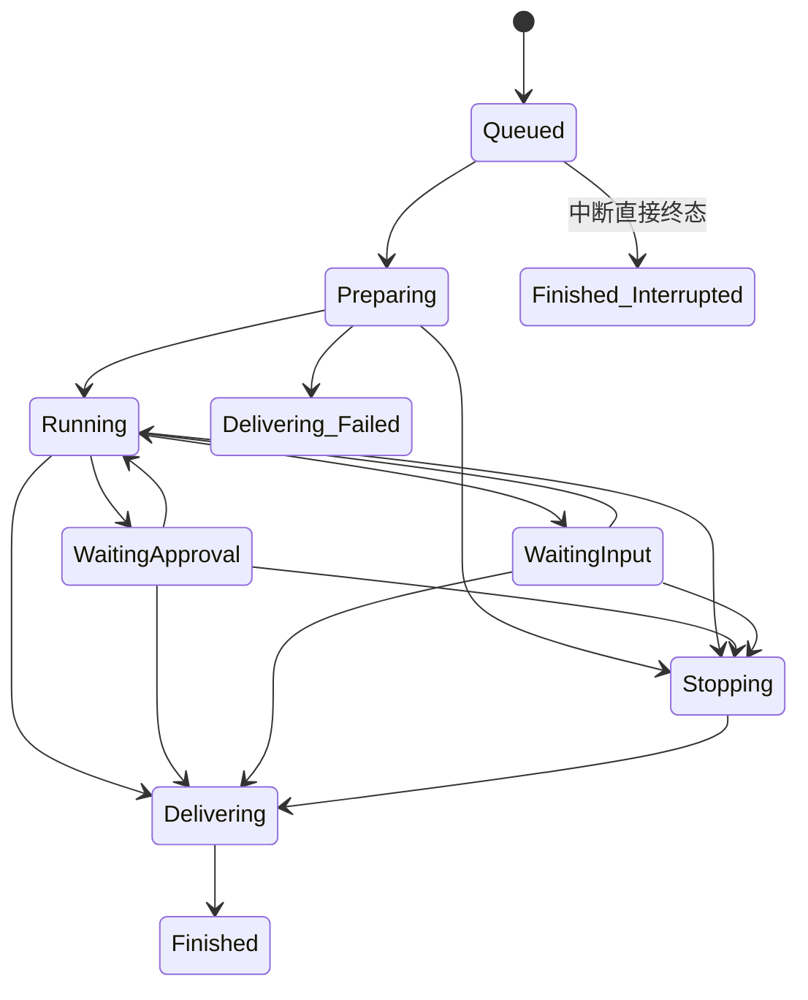

# bridge-core

协议无关的共享类型层：文本命令解析、会话身份、任务生命周期状态机与展示视图。整个 crate 只有 4 个源文件、约 300 行，仅依赖 `thiserror`——没有 serde、没有 tokio、没有任何 IO，因此可以被所有生产 crate 安全共享，也永远不会把厂商类型带进核心。

## 模块清单

| 文件 | 职责 | 关键导出 |
|---|---|---|
| `src/lib.rs` | 会话身份与执行模式 | `SessionKey`、`ExecutionMode` |
| `src/command.rs` | 文本命令解析为协议无关命令 | `Command`（15 变体）、`ParseError`、`Command::parse` |
| `src/task.rs` | 显式任务生命周期状态机 | `TaskId`、`TaskSpec`、`Outcome`、`TaskState`、`InvalidTransition` |
| `src/view.rs` | 平台无关的展示意图 | `Tone`、`ButtonStyle`、`ButtonAction`、`Button`、`Panel` |

## SessionKey 与 ExecutionMode

```rust
pub struct SessionKey { pub user: String, pub workspace: PathBuf }
pub enum ExecutionMode { Execute, Plan }   // 默认 Execute
```

一个「用户 + 规范化工作区绝对路径」唯一标识一次会话绑定。这个二元组贯穿运行时：调度队列、状态文件的复合键（落盘格式 `{user}:{workspace}`）、卡片按钮的属主校验都以它为准。`SessionKey` 派生 `Hash/Ord`，可直接做映射键。

## Command：文本与卡片两条入口的共同产物

模块注释「Text and card adapters both produce these commands」——飞书文本消息经 `Command::parse` 解析，卡片回调经 `bridge-feishu` 的动作解码，最终都收敛到同一个 `Command` 枚举，运行时只有一套命令路由。

| 变体 | 文本形式 | 说明 |
|---|---|---|
| `Help` / `Status` | `/help` `/status` | 查询类，忙时也可用 |
| `ChangeDirectory(Option<String>)` | `/cd [路径]` | 无参浏览当前目录，带参切换 |
| `ConfirmDirectory(String)` | `/cd-confirm <编号>` | 目录创建确认 |
| `New` | `/new` | 解绑当前会话 |
| `Resume(Option<String>)` | `/resume [ID]` | 无参列出会话 |
| `Archive(String)` / `Archived` / `Unarchive(String)` | `/archive` `/archived` `/unarchive` | 归档管理 |
| `Model(Option<String>)` / `Models` | `/model [ID\|default]` `/models` | 模型偏好 |
| `Plan(Option<bool>)` | `/plan [on\|off\|开启\|关闭\|退出]` | Plan 模式开关 |
| `Compact` | `/compact` | 上下文压缩 |
| `Stop(Option<String>)` | `/stop [任务]` | 停止 |
| `Approve { token, allow }` | `/approve <令牌>` `/deny <令牌>` | 文本形态的审批 |
| `Pair(String)` | `/pair <配对码>` | 配对 |

解析规则（`Command::parse`，src/command.rs）：

- 首尾去空白；不以 `/` 开头 → `ParseError::NotCommand`（普通任务文本）。
- 命令名大小写不敏感（` /CD dir with spaces ` 合法）；参数保留原始空格。
- `required()/optional()/no_arg()` 三个辅助闭包分别处理必填、可选与禁参。
- `/plan` 的参数映射：`on|开启|打开 → Some(true)`，`off|关闭|退出 → Some(false)`，其他值 `InvalidArgument`。
- 解析绝不调用 shell、绝不记录用户参数（模块注释显式声明）。

`ParseError` 三个变体的 Display 即用户文案：`不是文本命令`、`未知命令`、`命令参数无效或缺失`。

## 任务状态机：投递失败不改写执行结果

`TaskId` 是不透明类型，格式 `{epoch}:{counter}`（`TaskId::new(epoch, counter)`）——专用类型使任务 id、后端 thread id、卡片令牌在任何边界都不会互相混淆。`TaskSpec` 携带一个任务的全部输入：`id`、`session: SessionKey`、`chat`、`prompt`、`model: Option<String>`、`mode: ExecutionMode`。

```rust
pub enum TaskState {
    Queued, Preparing, Running, WaitingApproval, WaitingInput,
    Stopping, Delivering(Outcome), Finished(Outcome),
}
pub enum Outcome { Completed, Failed, Interrupted }
```

`TaskState::transition` 用 `matches!` 白名单强制合法转换：



模块注释即不变量：一旦进入 `Delivering(Completed)`，就不能回到 `Running`，也不能改判 `Finished(Failed)`——**投递失败永远不会改写执行结果**（测试 `final_outcome_cannot_be_replaced_by_late_progress_or_delivery_failure` 直接验证这一点）。运行时层有自己更细的 `Outcome`（bridge-app），这里的 `Outcome` 是核心层给状态机的最小终态。

## 视图类型：Panel 是渲染的唯一入口

```rust
pub enum Tone { Info, Success, Warning, Error, Muted }
pub enum ButtonStyle { Default, Primary, Destructive }
pub enum ButtonAction {
    Command(Command),                              // 命令按钮
    Interaction { token: String, choice: String }, // 不透明交互令牌
}
pub struct Button { label, description, section, group, separate, style, action }
pub struct Panel  { title, body, tone, buttons }
```

`Panel::text(title, body, tone)` 构造无按钮的纯文本面板。应用层（bridge-app）组装 `Panel`，适配层（bridge-feishu）负责把它落地成飞书 Card JSON 2.0——`Panel` 里没有任何飞书类型。`ButtonAction::Interaction` 的注释明确了安全边界：token 是不透明的本地令牌，应用层负责校验归属与允许的选项；适配层不得解释它。

## 测试

| 测试 | 覆盖 |
|---|---|
| `commands_preserve_paths_and_require_explicit_modes` | 大小写不敏感、带空格路径、`/plan` 合法与非法值、必填参数拒绝 |
| `final_outcome_cannot_be_replaced_by_late_progress_or_delivery_failure` | `Delivering(Completed)` 后不可回退、不可改判失败 |
