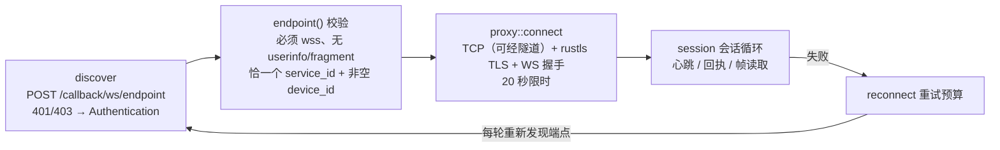
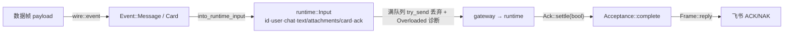
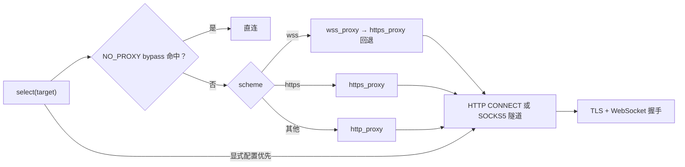

# bridge-feishu

飞书传输与线上协议解码边界（src/lib.rs 模块注释「Feishu transport and wire decoding boundary」）：入站经官方长连接 WebSocket（pbbp2 protobuf 帧 + 事件 JSON）接收消息与卡片回调并完成回执；出站实现 `Messenger` 与 `ResourceFetcher` 两个端口，用 REST 发文本/卡片、上传成果、下载附件。这是工作区中唯一同时依赖 bridge-app 端口与真实网络栈（tokio-tungstenite、reqwest、tokio-rustls）的 crate。

## 模块清单

| 文件 | 职责 | 关键导出 |
|---|---|---|
| `src/lib.rs` | 根：卡片动作解码、附件/文本提取 | `decode_action`、`decode_control_action`、`attachments`、`message_text`、`DecodeError` |
| `src/ingress.rs` | 版本化入站事件与一次性回执 | `Received`、`Acceptance`、`Event`、`ConnectionState`、`into_runtime_input`、`decode_card_click`、`MAX_FRAME_BYTES` |
| `src/websocket/mod.rs` | 长连接客户端：发现、会话、心跳、重连 | `Client`、`ClientConfig`、`Endpoint`、`Error` |
| `src/websocket/wire.rs` | pbbp2 帧定义与校验、分片重组、事件解码 | `Frame`、`Header`、`Fragments`、`Frame::ping/reply` |
| `src/rest.rs` | REST 客户端，实现 Messenger + ResourceFetcher | `FeishuRest` |
| `src/cards.rs` | Card JSON 2.0 渲染器 | `render`、`action_value` |
| `src/proxy.rs` | 代理策略与隧道 | `Policy`、`connect`（`proxy_tls_tests.rs` 为其内联测试模块） |

## 连接生命周期



- 端点发现响应限 64 KiB；URL 长度上限 16384；`code == 0` 通过，`1|1000040343` → Transport，其他 → Authentication。
- WebSocket 握手（tungstenite `client_async_tls_with_config`）限 `max_message_size = max_frame_size = 2 MiB`；HTTP 403、`handshake-status: 403` 或 `handshake-autherrcode: 1000040350` → Authentication。
- 连接前后向 incoming 通道广播 `Event::Connection{state: Starting/Connected/Reconnecting}`（队列满 → `Error::Overloaded`）。

### 错误类型（`websocket::Error`）

`Transport`（网络失败兜底）/ `Protocol`（协议无效）/ `Authentication` / `Overloaded`（事件队列满或关闭）/ `Exhausted`（重试次数用完）/ `Proxy`（代理配置无效）。重连策略按错误分类：`Authentication/Proxy/Overloaded` 立即终止不重试。

## wire 帧：pbbp2 protobuf

```rust
pub struct Header { key /*tag1*/, value /*tag2*/ }
pub struct Frame { seq_id, log_id, service, method, headers, payload_encoding, payload_type, payload, log_id_new }
```

字段号对照官方 SDK 逐字节验证（集成测试用官方 Python SDK 的 21 字节 ping 流比对）。payload 本体就是 JSON，`payload_encoding` 只作为分片身份字段，不做压缩/base64。

- **帧校验**（`Frame::parse`）：长度 ≤ 2 MiB；`seq_id/log_id/service` 必填；`method ∈ {0,1}`；headers ≤ 64 条、key ≤ 64 B、value ≤ 4096 B、key 唯一。
- `method == 0` 是心跳控制（`type: ping/pong`）；`method == 1` 是数据帧（header `type` 为 `event` 或 `card`，其他忽略）。
- **回执**（`Frame::reply` / `reply_with_card`）：追加/替换 header `biz_rt` = 处理耗时毫秒；payload 为 `{"code":200}`、`{"code":500}`，已接受且是卡片时为 `{"code":200,"data":"e30="}`（`{}` 的 base64）。回执复用原帧 `seq_id/log_id_new`。

### 分片重组 `Fragments`

分片 header：`message_id`、`sum`（总片数）、`seq`（片序）。所有片必须签名一致（`MessageSignature`：kind/trace_id/service/payload_encoding/payload_type），不一致即丢弃整个 assembly（fail-closed）。支持乱序与重复片；同位置冲突 → `Error::Protocol`。限额：`MAX_MESSAGE_ID=1024`、`MAX_FRAGMENTS=64`、`MAX_ASSEMBLIES=64`（超限 → Overloaded）、全局字节预算 `MAX_TOTAL_BYTES=8 MiB`、单消息 `MAX_ASSEMBLED_BYTES=2 MiB`、`ASSEMBLY_TTL=5s`（每次 push 时清理过期 assembly）。

## 心跳与 ClientConfig 热更新

`ClientConfig`（PascalCase serde，来自服务端）字段与默认值：`reconnect_count = -1`（无限）、`reconnect_interval = 120` 秒、`reconnect_nonce = 30` 秒、`ping_interval = 120` 秒。校验范围：count ∈ [-1,10000]、interval ∈ [1,3600]、nonce ≤ 300、ping ∈ [1,3600]，越界 → Protocol。

- 会话循环 `tokio::select!` 同时处理取消、到点 ping、回执写回、socket 读；到点发 `Frame::ping(service)` 后按（可能已更新的）`ping_interval` 重排。
- **pong 截止** `= 2×ping_interval + 5` 秒；超时发诊断 `HeartbeatTimeout` 并以 Transport 断连。
- **pong payload 热更新**：非空时 `config.update(&payload)`——部分更新、先构造候选再校验，失败整体不生效（原子性有测试）。
- WS 层 Ping/Pong 控制帧同样处理：收 Ping 回 Pong（1 秒写预算内），Close → Transport。

## 重连策略

- **重试预算**：仅当一次连接存活 ≥ `STABLE_CONNECTION = 60s` 才清零 `attempts`；短命连接不重置。
- **退避**：首次重试 `rand() × reconnect_nonce` 秒抖动，之后固定 `reconnect_interval` 秒；睡眠可被取消打断。
- **上限**：`reconnect_count >= 0 && attempts > count` → `Error::Exhausted`。
- 每轮尝试都重新发现端点（新 URL/凭据）；每轮结束发诊断 `Reconnect` + 对应 Status。

## ingress：事件解码与恰好一次回执



- `Event::Message` 提取 `message_id/user_id/chat_id/chat_type/message_type/content`（sender 为 `app` 的事件忽略，未知 sender → Protocol；content 是内嵌 JSON **字符串**，需二次解析）。字符串字段统一上限 1024 字节且非空，否则 Protocol。
- `Event::Card`（`card.action.trigger`）取 `action=value`（必须 object）、`message_id=open_message_id`、`user_id=operator.open_id`、`chat_id=open_chat_id`；卡片输入的持久化 id 为 `card:{message_id}`，`text` 恒为 `None`——**卡片回调永远不能变成聊天文本**。
- `decode_card_click` 只放行 `ButtonAction::Interaction{token, choice == "run"}` 且 source 非空的点击为 `bridge_app::cards::Click`；其余（含未知命令）返回 `None`——「只有本地注册的不透明动作能进入运行时，原始卡片命令不能绕过属主校验」（模块注释）。
- **回执背压**：待裁决回执上限 `MAX_PENDING_REPLIES = 64`，满即直接 NAK；应用在 `WRITE_BUDGET = 1s` 内不裁决（接收者被 drop 或超时）按 `accepted=false` 回 NAK。取消时未裁决的回执随任务 drop（`Ack::Drop` 即 NAK，链路闭合）。

### 文本与附件提取（lib.rs）

- `message_text`：`text` → content.text；`post` → 标题 + 各行 text 节点（行/节点上限 4096，行间换行、part 空格连接）；全空白 → None；媒体消息无文本。
- `attachments`：`image` → `image_key`；`file|audio|media|video` → `file_key`（media/video 回退 `media_key`）；`post` 递归取 `img`/`file`/`media` 节点（上限 `MAX_POST_NODES = 4096`，按 resource.key 去重）。达到 `ATTACHMENT_OVERFLOW_SENTINEL = 11`（运行时上限 10 + 一）即停，让应用层显式拒绝而不是静默截断。key ≤ 1024 字节；名字截断到 200 字符（不信任远端文件名做路径）。

## REST：FeishuRest

刻意不实现 `Debug`（防凭据进日志）。构造：HTTP 客户端总超时 30 秒、连接 10 秒；按目标 `https://open.feishu.cn/` 从 `Policy` 选择代理挂到 reqwest；`requests = Semaphore(4)`、`transfers = Semaphore(2)`（上传下载共享）。

- **鉴权**：`POST auth/v3/tenant_access_token/internal`；token 缓存到 `expire - 120` 秒（expire 缺省 7200、上限 86400）。
- **响应检查**：非 2xx → `Rejected(status)`；JSON 累计上限 2 MiB（超 → Incompatible）；业务码 `code != 0` → `Rejected(code)`——HTTP 200 也可能被业务码拒绝，测试确保 429/99991663 不被掩盖。
- **路径安全**：路径段经 `Url::path_segments_mut` 编码，消息 id 无法注入路径/查询/片段（有测试）。

| 操作 | 端点 | 说明 |
|---|---|---|
| 发卡片 | `POST im/v1/messages?receive_id_type=chat_id`（`msg_type=interactive`） | content = `cards::render(panel)`，返回 MessageId |
| 更新卡片 | `PATCH im/v1/messages/{id}` | 原地更新交互卡片 |
| 发文本 | 同发消息（`msg_type=text`） | 空文本兜底「（无文本回复）」；按 **3500 字符** 分片顺序发送 |
| 上传图片 | `POST im/v1/images`（multipart，`image_type=message`） | 拿到 image_key 后发 `msg_type=image` 消息 |
| 上传文件 | `POST im/v1/files`（multipart，`file_type=stream`） | 定长流式上传；超 `max_attachment` → `TooLarge` |
| 下载资源 | `GET im/v1/messages/{id}/resources/{key}?type=…` | 先查 content_length，流式落盘并累计，超限 → `TooLarge`；`sync_all` 后返回字节数 |

**无自动重试**：所有错误折叠为 `DeliveryError::{Transport, Rejected(i64), Incompatible, TooLarge, LocalIo, Authentication}`，重试决策留给应用层。

## 卡片渲染

- `action_value`：`Interaction{token, choice}` → `{"command":"/interaction","token","choice"}`；`Command` 变体映射为对应命令 JSON（`/plan-toggle`、`/cd-confirm` 等）。`Command::Approve` 映射为 `/interaction` 的 `allow/deny`、`Command::Pair` 映射为 `/help`——**配对码绝不进卡片回调**。实际所有卡片按钮都由 bridge-app 的通用装配器生成为 `Interaction{choice:"run"}`，命令串登记在运行时侧；这些映射是渲染端的完整性保证。
- `render`：`schema 2.0` + header 模板色（`Tone` → `blue|green|yellow|red|grey`）+ body 元素。首元素 markdown 正文（空 → 「（无内容）」）；`section`/`description`/`separate`/组变化插入 `hr`；`description` 按钮独立成行（移动端布局）；同 `group` 的按钮渲染为 `column_set` 等宽列。布局元数据（`_group` 等）绝不进按钮 schema（测试断言）。
- 按钮结构：`{"tag":"button","width":"fill",…,"type":"default|primary|danger","behaviors":[{"type":"callback","value":action_value(...)}]}`。

## 代理：Policy 与隧道



- `Policy::from_env(explicit)`：显式值优先；否则依次读（大小写各一遍）`https_proxy/HTTPS_PROXY`、`wss_proxy/WSS_PROXY`、`http_proxy/HTTP_PROXY`、`all_proxy/ALL_PROXY`、`no_proxy/NO_PROXY`。代理 URL 校验：scheme ∈ `http/https/socks5/socks5h`、必须有 host、无 query/fragment、path 为空或 `/`。
- `bypass`：`*` 全绕过；CIDR（v4/v6）；完整 host 或前导点域后缀；可选 `:port`；支持 IPv6 方括号字面量。
- `http_connect`：最小 RFC 7231 实现——`CONNECT host:port HTTP/1.1` + `Proxy-Authorization: Basic`（凭据 percent-decode，认证头 > 4096 B 拒绝）；响应头逐字节读、上限 8192 B；要求 200；5xx → Transport，其余失败 → Proxy。IPv6 目标写成 `[host]:port`。
- `socks_connect`（RFC 1928）：greeting `[5,1,0]` 无凭据 / `[5,1,2]` 用户名密码；`socks5` 且目标非 IP 时本地解析；`socks5h` 直接把域名交代理解析（远端 DNS）；ATYP 1/3/4；任何失败折叠为 Transport/Proxy，不回显细节。
- 代理 scheme 为 `https` 时先对代理自身套 TLS。TLS 配置统一 rustls（ring）+ webpki-roots。`Policy` 刻意不实现 `Debug`。

## 常量速查

| 常量 | 值 | 位置 |
|---|---|---|
| `MAX_FRAME_BYTES` | 2 MiB | ingress.rs（wire/proxy/websocket 共用） |
| `STABLE_CONNECTION` | 60 秒 | websocket/mod.rs |
| `MAX_PENDING_REPLIES` / `WRITE_BUDGET` | 64 / 1 秒 | websocket/mod.rs |
| `pong_deadline` | `2×ping_interval + 5` 秒 | websocket/mod.rs |
| ClientConfig 默认 | count −1、interval 120、nonce 30、ping 120 | websocket/mod.rs |
| 分片限额 | 64 片 / 64 assembly / 8 MiB 总 / 2 MiB 单条 / TTL 5s | wire.rs |
| `MAX_POST_NODES` / 哨兵 / key / 名字 | 4096 / 11 / 1024 / 200 字符 | lib.rs |
| REST 超时与并发 | 总 30s 连接 10s；requests 4、transfers 2 | rest.rs |
| REST 响应上限 / 文本分片 / token 缓存 | 2 MiB / 3500 字符 / 提前 120 秒刷新 | rest.rs |
| 代理限额 | CONNECT 认证头 4096 B、响应 8192 B；SOCKS5 凭据各 255 B、缺省端口 1080 | proxy.rs |

## 测试覆盖

| 测试 | 覆盖 |
|---|---|
| `websocket/reconnect_tests.rs` | ClientConfig 原子更新、重试预算与 Exhausted、每轮重新发现端点、永久错误不重试、取消打断拨号、稳定连接重置预算 |
| `proxy_tls_tests.rs` | 自签 TLS 下 direct / http / https 三种模式完整 WS 收发；错误主机名与不受信证书被拒 |
| `tests/native_websocket.rs` | 回执 drop/队列满即 NAK、ping 字节级对齐官方 SDK、端点校验、分片乱序/冲突/TTL、事件解码、ACK 期间响应 Ping/Pong、回执 seq 对齐、pong 热更新与心跳超时 |
| `tests/native_proxy.rs` | 代理优先级与 bypass 边界、CONNECT 认证与状态分类、SOCKS5h 远端 DNS |
| `tests/actions.rs` / `tests/media.rs` | 命令往返无损、缺失参数拒绝；post 附件 locale/去重/溢出哨兵、media_key 回退 |
| `rest.rs` 内联 | 业务码拒绝不掩盖 HTTP 状态、非 JSON/超限 → Incompatible、消息 id 不可注入 URL |
