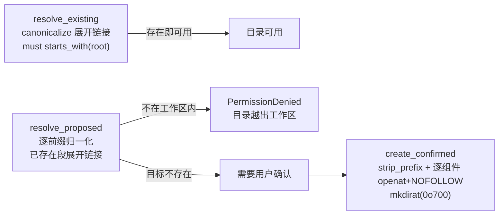
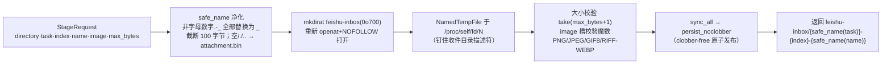

# bridge-local

版本化的本地持久状态与文件系统安全边界：JSON 状态存储、去重日志、工作区路径校验、快照/diff、附件暂存。模块注释「Versioned local state and workspace access; no network or vendor protocols」——本 crate 触得到磁盘，但触不到网络；它实现 bridge-app 的存储与文件端口（`SessionStore`/`DirectoryStore`/`DurableJournal`/`MessageJournal`/`LocalFiles`），被 bridge-cli 装配。

## 模块清单

| 文件 | 职责 | 关键导出 |
|---|---|---|
| `src/state.rs` | 单写者 JSON 状态存储与去重日志 | `State`、`JsonStore`、`StoreError`、`atomic_json`、`SCHEMA_VERSION`、`SEEN_LIMIT` |
| `src/async_state.rs` | 把阻塞存储包装为异步端口实现 | `AsyncState`（实现三个 port） |
| `src/safeio.rs` | 文件访问安全原语（唯一审计面） | `open_regular`、`open_directory`、`pinned_path` |
| `src/workspace.rs` | 工作区根的路径解析/校验/受控建目录 | `Workspace` |
| `src/snapshot.rs` | 有界快照扫描、SHA-256、文本分类、diff 渲染 | `scan_excluding`、`diffs`、`artifacts`、`file_kind` |
| `src/workspace_files.rs` | 文件端口实现：扫描、附件暂存、稳定句柄 | `WorkspaceFiles` |

## 状态存储：一个 JSON 文件 + 一个去重日志

`State`（src/state.rs）就是 `state.json` 的全部内容，`deny_unknown_fields`——未知字段导致解析失败而不是被静默丢弃：

```json
{
  "schema_version": 1,
  "sessions":     { "{user}:{workspace}": "thread-id" },
  "models":       { "{user}:{workspace}": "model-id" },
  "directories":  { "{user}": "/abs/path" },
  "plan_modes":   { "{user}:{workspace}": true },
  "allowed_open_ids": ["ou_xxx"]
}
```

注意键的差异：`sessions/models/plan_modes` 用 `SessionKey` 的复合键格式 `{user}:{workspace}`（`async_state::key` 生成，注释强调「这个格式就是磁盘上的键，永不改变编码」），`directories` 以纯 user 为键。

去重日志 `seen-messages.json` 结构为 `{schema_version, ids: Vec<String>}`：FIFO、去重保留最新位置、裁剪到 `SEEN_LIMIT = 1000` 条；打开时条数超限或含空 id 即 `InvalidData`。

### JsonStore：单写者 + 原子提交 + Uncertain

```rust
pub struct JsonStore { directory, _lock: File, state: State, journal: Journal, healthy: bool }
```

- **单写者**：`open` 对 `state.lock` 做 `try_lock_exclusive`（fs2），第二个打开者得到 `StoreError::Locked`；目录 0o700，状态与锁文件 0o600。
- **写入协议**（`atomic_json`）：同目录私有临时文件（NamedTempFile，创建即 0600）→ pretty JSON + 换行 → `sync_all()` → `persist()`（rename 原子替换）→ 父目录 fsync。模块注释「Atomic replacements precede in-memory commits」——`self.state` 只在磁盘提交成功后才更新。
- **备份先行**：`replace` 若 `state.json` 已存在，先写 `state.previous.json`；备份写入失败则以 `?` 直接返回，主写入根本不发生。
- **Uncertain**：任何主提交失败置 `healthy = false`，此后所有变更操作返回 `StoreError::Uncertain`（「写入结果不确定，必须重新打开存储后再操作」）。测试验证：提交失败后内存与磁盘都不前进、后续操作被拒、备份名被目录占用时授权不落盘。
- **不重置**：损坏的 JSON 或 `schema_version != 1` 直接报错，绝不静默重置用户数据（测试 `malformed_and_future_state_are_not_reset`）。

`StoreError` 变体：`Io` / `Json` / `Version(u32)` / `Locked` / `Uncertain` / `EmptyMessage`。`claim_message`（实现 `MessageJournal` port）语义：**持久化成功之前不得报告成功**；重复返回 `Ok(false)`；`Uncertain` 短路一切。`State::clear_thread(thread)` 在同一次提交中删除所有指向该 thread 的绑定（归档原子性）。

## AsyncState：异步包装的三个 port

```rust
#[derive(Clone)]
pub struct AsyncState { pairing_code: Option<Arc<String>>, store: Arc<Mutex<JsonStore>>, slots: Arc<Semaphore /* 2 */> }
```

- 启动时把已持锁的 `JsonStore` 所有权移入，不存在第二个写者；`run<T>` = 获取信号量槽 → `spawn_blocking` → 锁内执行操作。
- **取消安全**：permit 与锁都移入阻塞任务内部，调用者被 abort 也不会放弃进行中的持久提交（测试 `cancelling_caller_does_not_abandon_started_commit`）。
- 错误映射 `store_failure`：`StoreError` → `SessionStoreError`（bridge-app），Display 恒为「状态保存或读取失败」，类别保存在 `kind()` 供运维。
- 输入校验镜像 runtime 常量：`PATH_BYTES = 4096`、`NAME_BYTES = 256`（与 `bridge_app::runtime::limits` 必须一起改，注释显式声明）。

三个 port 的方法要点：

| port | 方法 | 语义要点 |
|---|---|---|
| `DirectoryStore` | `propose_directory` | 返回 `Some(target)` 表示需要确认；**绝不创建**。相对路径先校验当前目录快照 |
| | `create_directory` | 重算提案必须与确认目标完全一致（防确认窗口内路径被换）；`create_confirmed` 后复验快照；持久化 `directories[user]` |
| | `validate_directory` | 拒绝已删除/移动/重定向的目录快照（开工前调用） |
| | `inspect_directory` | `read_dir` 上限 1000 条目、输出 20 项；名字须无控制字符且逐组件可安全打开 |
| | `change_directory` | 解析与持久化在同一个串行本地操作内完成 |
| `SessionStore` | `pair` | 无配对码 → `Ok(false)`；码长 16–256；**常量时间比较**（逐字节累积差值，不提前返回）；成功仅持久化 user 到 `allowed_open_ids`，配对码本身永不落盘；写失败不授权 |
| | `bind` / `thread` / `clear` | 绑定/读取/解除（`clear` 只解除该 `SessionKey`，不归档后端线程） |
| | `preferences` / `set_preference` | 模型与 Plan 偏好，按 `SessionKey` 作用域，写失败保留旧值 |
| | `clear_thread` | 归档后使本地引用失效 |
| `DurableJournal` | `claim` | true = 持久认领成功；false = 重复消息，**不是再次执行的许可** |

辅助：`bound_threads()`（启动期归档对账用）、`clear_archived_bindings()`（一次提交清除全部归档绑定）、`with_pairing()`。

## safeio：唯一的文件安全原语面

威胁模型（模块头）：攻击者可投放符号链接或在打开与读取之间替换路径组件（TOCTOU）。防御：每个路径组件都基于已持有的目录描述符逐组件 `openat` 并加 `O_NOFOLLOW`——被替换的链接使打开失败，而不是静默重定向。模块注释：「All three primitives here must stay equivalent — audits only need to check this file.」

| 原语 | 行为 |
|---|---|
| `open_regular(root: &File, relative: &Path)` | 逐组件 openat（相对 root fd），最后一级不带 DIRECTORY，由调用方 `is_file` 校验；`O_NONBLOCK` 防止最终组件被换成 FIFO 时挂起 |
| `open_directory(path: &Path)` | 要求绝对路径，从 `/` 走到目标，**拒绝 `..` 组件**；整条链每级 NOFOLLOW |
| `pinned_path(file: &File)` | 返回 `/proc/self/fd/<n>`——目录被改名或父目录被替换后，路径仍钉在描述符上（Linux-only） |

所有遍历共用 `WALK_FLAGS_BASE = RDONLY | NOFOLLOW | CLOEXEC | NONBLOCK`：无符号链接替换、无 fd 泄漏到子进程、不在 FIFO 上阻塞。相对路径只接受 `Component::Normal`（`..`、`.`、根、前缀一律拒绝）。

## Workspace：路径校验与受控建目录

`Workspace::new(root)` 用 `fs::canonicalize` 得到真实根，不改变进程 cwd。三个方法构成目录操作的完整规则：



- `resolve_existing`：canonicalize（要求存在并展开符号链接）后必须仍在 `root` 下且是目录——指向工作区外的符号链接因此被拒。
- `resolve_proposed`：目标可能不存在，逐前缀处理：`..` 弹栈、`.` 跳过、已存在的段 canonicalize 展开链接、悬空链接报错；最终越界拒绝。**此函数绝不创建**，用户确认后由 `create_directory` 重算并要求一致。
- `create_confirmed`：`strip_prefix(root)` 失败（越界）或含非 `Normal` 组件（非规范）即拒；逐组件 openat + NOFOLLOW，`mkdirat(Mode::RWXU)`（0o700），`EXIST` 竞态容忍后重开。注释：「失败可能留下已创建的父目录，绝不隐式删除」。

## snapshot：有界快照、分类与 diff

`scan_excluding(root, limits, excluded)` 用 `walkdir`（不跟随链接、按名排序）扫描，任何失败（条目超限、不可读、打开失败）只置 `complete = false` 并继续，绝不中断整体、绝不声称删除（截断的 after 扫描不得产生「删除」diff）。Limits 默认值（类型在 bridge-app/src/files.rs）：

| 项 | 默认值 | 说明 |
|---|---|---|
| `files` | 200 | 纳入快照的文件数上限 |
| `text_bytes` | 256 KiB | 单文件文本读取上限 |
| `entries` | 10 000 | 遍历条目上限 |
| `diff_chars` | 20 000（成果投递时覆盖为 4 000） | 单个 diff 的字符预算 |

分类规则（`file_kind` + snapshot.rs 常量）：

- 忽略目录 15 个：`.git`、`.runtime`、`feishu-inbox`、`__pycache__`、`.venv`、`venv`、`node_modules`、`.pytest_cache`、`.mypy_cache`、`.ruff_cache`、`.cache`、`target`、`build`、`dist`、`.bridge-state`；忽略扩展名 9 个（编译产物）。
- **隐私红线**：`.env`、`.env.*`（`.env.example` 除外）、`.feishu-codex*` 开头的文件永远 `Ignore`，不进快照与 diff。
- `Artifact`（图片/文档/压缩包等 30 种扩展名）：只记元数据；≤20 MiB 的流式计算 SHA-256（64 KiB 缓冲），digest 是变化判定的第一依据——仅 mtime 变化不算变化。
- `Text`：读取失败/过大/含 `\0`/非 UTF-8 分别记 skip 标签（「无法读取」「文件过大」「二进制文件」「非 UTF-8 文本」），这些标签是用户可见说明而非错误。

`diffs` 渲染：`similar::TextDiff::from_lines` 统一 diff（上下文半径 3），操作标签「新增/修改/删除」（开始快照不完整时改「变化（开始快照未完整覆盖）」），按 `diff_chars` 截断并显式标注；围栏反引号按内容中最长反引号串 + 1 动态加长（≥3），防止 diff 内容逃逸 Markdown 围栏；末尾换行状态变化会附加说明。

## WorkspaceFiles：附件暂存与稳定句柄

`WorkspaceFiles` 是零大小结构，实现 `LocalFiles` port。核心是 `stage_attachment` 的 durable 暂存管线：



要点：名字在可见之前完成全部校验；失败不留下已发布的名字（测试断言失败后收件目录只剩临时残留之外无发布物）；`persist_noclobber` 防覆盖同名文件。

`open_stable(directory, relative, max_bytes)`：逐组件 NOFOLLOW 打开 → 校验大小 → **复制进私有内存句柄**——「后续编辑不能改变已在进行的上传」；复制过程中文件仍在增长则以 `growing file` 拒绝。`scan`/`diffs`/`artifacts` 直接转发 snapshot 模块，扫描根经 `pinned_path` 钉住。

## 测试覆盖（24 个，全部内联）

| 主题 | 代表测试 |
|---|---|
| 持久先于内存 | `failed_commit_never_advances_memory_or_allows_work`、`preference_write_failure_preserves_previous_values` |
| 单写者与重启 | `persistence_lock_and_restart_dedup`、`concurrent_bindings_survive_reopening` |
| 取消安全 | `cancelling_caller_does_not_abandon_started_commit` |
| TOCTOU 防御 | `secure_open_rejects_symlinks_in_any_component`、`paths_and_links_stay_in_workspace` |
| 隐私红线 | `engineering_text_diff_and_artifacts_remain_separate`（`.env`/`target/` 不进快照）、`pairing_is_durable_idempotent_and_never_stores_secret`（state.json 不含配对码） |
| 有界性 | `journal_is_bounded_and_archive_preserves_unrelated_bindings`（1000 条裁剪）、`truncated_scans_do_not_claim_deletions_or_upload_binary_text` |
| 暂存原子性 | `staging_publishes_durably_and_rejects_invalid_images_or_oversize`、`stable_handles_survive_later_edits_and_enforce_size` |

## 常量速查

| 常量 | 值 | 位置 |
|---|---|---|
| `SCHEMA_VERSION` | 1 | state.rs |
| `SEEN_LIMIT` | 1000 | state.rs |
| 状态文件 | `state.json` / `state.previous.json` / `seen-messages.json` / `state.lock` | state.rs |
| 目录/文件权限 | 0o700 / 0o600 | state.rs |
| `PATH_BYTES` / `NAME_BYTES` | 4096 / 256 | async_state.rs |
| 并发槽 | `Semaphore::new(2)` | async_state.rs |
| 配对码 | 16–256 字节，常量时间比较 | async_state.rs |
| `inspect_directory` | 读取 ≤1000、输出 ≤20 | async_state.rs |
| `ARTIFACT_HASH_LIMIT` | 20 MiB | snapshot.rs |
| 附件名净化 | 100 字节；收件目录 `feishu-inbox`（0o700） | workspace_files.rs |
