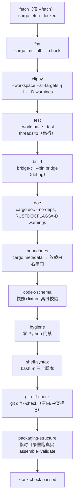
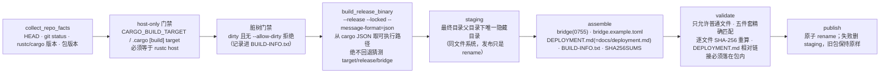

# 工具链与脚本

仓库的校验、打包与生命周期脚本。核心原则：`cargo xtask check` 是唯一校验入口，任何一步失败立即中止；打包绝不猜测产物路径、绝不半成品发布。

## xtask

`cargo xtask …` 经 `.cargo/config.toml` 的 alias 转发为 `cargo run --quiet --package xtask -- …`。xtask 刻意**不依赖任何生产 crate**（仅 jsonschema/serde_json/sha2/tempfile）——注释说明 `cargo xtask check` 通过该包自举，生产代码重构时它必须保持可编译。命令分发支持 `check`、`check-boundaries`、`fetch`、`package`、`codex-schema`、`help`。

### `cargo xtask check` 的 11 步流水线

`fetch`（`cargo xtask fetch`）把网络访问与校验分离：预取锁定依赖后，`cargo xtask check --offline` 可完全离线执行。全部嵌套 cargo/git 调用经 `cargo_cli.rs`：`cargo run` 注入的 20 个环境变量（`CARGO_MANIFEST_DIR`、`CARGO_PKG_*` 等）在每次嵌套调用前被移除，避免 fingerprint 变化触发全量重建（有单测守护）。

### check-boundaries：依赖白名单门

基于 `cargo metadata --no-deps --locked` 的 JSON。每个 workspace 包必须注册；依赖按**真实包名**匹配（`rename` 别名不参与判断，有测试）；kind 缺省 normal。两条硬规则：

1. 生产包对开发工具（`xtask`、`test-support`）的 normal/build 依赖一律拒绝——「only dev-dependencies may use test tooling」。
2. 任何依赖都必须落在该包该 kind 的白名单内——「review architecture before changing it」。

当前规则表（xtask/src/boundaries.rs 的 `RULES`）：

| 包 | 普通（normal）依赖白名单 | dev 白名单 |
|---|---|---|
| `bridge-core` | thiserror | — |
| `bridge-app` | bridge-core, tempfile, thiserror, tokio, tokio-util | — |
| `bridge-local` | bridge-app, bridge-core, fs2, rustix, serde, serde_json, sha2, similar, tempfile, thiserror, tokio, walkdir | — |
| `bridge-feishu` | base64, bridge-app, bridge-core, futures-util, ipnet, percent-encoding, prost, rand, reqwest, serde, serde_json, thiserror, tokio, tokio-rustls, tokio-tungstenite, tokio-util, webpki-roots | http, rcgen, tempfile, tokio |
| `bridge-codex` | bridge-app, bridge-core, futures-util, rustix, serde, serde_json, thiserror, tokio, tokio-util | jsonschema, sha2, tempfile |
| `bridge-cli` | bridge-app, bridge-codex, bridge-core, bridge-feishu, bridge-local, clap, fs2, rustix, serde, serde_json, sha2, tempfile, tokio, tokio-util, toml | test-support, tokio |
| `xtask` / `test-support`（DevTool） | 各自依赖 | DevTool 可自由依赖生产 crate |

### codex-schema：协议快照 check / export

- **check**（离线，check 流水线的一部分）：快照与 fixture 目录必须成对存在；`manifest.json` 的 `cli_version` 必须等于目录名、`command` 必须等于生成命令原文；逐文件 SHA-256 比对；目录内不得有 manifest 未列出的 JSON；9 个必需文件齐全且各自是合法 JSON Schema；fixture 按名字规则配对校验（`turn-start-*.json` → TurnStartParams；`server-requests.json` 每个用例的 params/reply 分别过 Params/Response schema）。
- **export**（手工维护，**绝不进 CI**）：`cargo xtask codex-schema export --codex <路径> [--version x.y.z] [--force]`。流程：`<codex> --version` 与给定版本一致 → 临时目录执行 generate-json-schema（每个 token 独立参数、无 shell）→ 生成确定性 manifest → 必需文件检查 → **兼容性步骤：候选 schema 必须仍接受仓库全部已记录 fixture**，否则拒绝（除非 `--force`）→ staging 目录组装校验后原子发布（旧目录挪走 → staging 进位 → 删旧；失败回滚）。结束后打印手动后续：记录 fixtures、跑 bridge-codex 协议契约测试、更新 `CODEX_SCHEMA_BASELINE`——都在同一个评审 PR 里完成。

### hygiene：零 Python 门禁

只检查一件事：全部跟踪文件（含 YAML workflow）不得出现 Python 源码/字节码后缀（`.py/.pyi/.pyc`）、`requirements*.txt` 清单，以及行内容包含解释器调用模式（`python3`、`python -m`、`pip install`——因此本仓库文档也不得出现这些字面量）。唯一豁免是 hygiene.rs 自身。结束打印 `repository hygiene passed (N tracked files scanned, Python-free)`。**注意它不检查 docs 内容、mermaid 或文档链接**（文档链接检查只存在于打包路径，见下）。

### package：发布打包

`BUILD-INFO.txt`（确定性渲染，同 commit 两次打包字节一致）：`build-info-format: 1`、package/version/commit/dirty（含 dirty-files 列表）/target/profile: release/rustc/cargo/allow-dirty。校验和文件对四个分发文件（bridge、bridge.example.toml、DEPLOYMENT.md、BUILD-INFO.txt）按固定顺序写 `<sha256>  <name>`。文档链接检查跳过代码围栏与锚点/外链，拒绝绝对路径与含 `..` 的段。成功输出 `published package: <dir>` 与 `host-only build; no cross-compilation was performed`。

## 仓库脚本

### setup.sh（首次配置与启动）

1. 参数：`--check` → 直接 `bridge config check`；`--no-start` → 构建与配置后退出；无参全流程。可用的环境变量：`BRIDGE_RUST_ROOT/CWD/STATE_DIR/ALLOWED_USERS/SANDBOX/AUTO_INSTALL/BIN/CONFIG`。
2. 工具链：cargo/rustup/cc 缺失时经 apt-get 安装 `build-essential curl` 并用官方脚本装 rustup（`--profile minimal`）；非交互需 `BRIDGE_RUST_AUTO_INSTALL=1`。
3. `cargo build -p bridge-cli --bin bridge --locked`（debug）。
4. 配置：已有配置只跑 `config check` 并保留；否则按交互/环境生成（root/cwd 默认 `$HOME`、state 默认 `~/.local/state/feishu-codex-bridge`、用户列表决定配对码模式、sandbox 默认 workspaceWrite），`pwd -P` 规范化后调 `bridge config init`。
5. 凭据：`bridge credentials --file … --print` 输出 export 语句，脚本 eval 后 `unset`（凭据不进 shell 历史、不进配置）；打印 `/pair <码>` 提示；最后 `exec ./start.sh start`。

### start.sh（生命周期转发）

动作白名单 `start|restart|foreground|stop|status`（其他 exit 2）。`start/restart/foreground` 先经 `bridge credentials --print` 获取凭据再 `eval`；`foreground` → `exec bridge guard --config`；`start/restart/stop/status` → `bridge service --config <cfg> <action>`（配对码存在时打印 `/pair` 提示）。二进制不存在则提示先跑 setup.sh。

### package.sh

转发 `exec cargo xtask package --release "$@"`，参数透传。

## CI（.github/workflows/ci.yml）

- 触发：pull_request 任意分支 + push 到 main/master；权限仅 `contents: read`；并发组取消进行中的旧运行。
- job `rust`（ubuntu-24.04，45 分钟超时）：
  1. checkout 固定到具体 commit SHA（不漂浮）。
  2. `rustup toolchain install 1.85.1 --profile minimal --component rustfmt,clippy`（CI 基准固定 1.85.1，与 workspace `rust-version = "1.85"` 一致；rust-toolchain.toml 的 channel 是浮动 stable）。
  3. `cargo xtask fetch` → `cargo xtask check --offline`。
  4. 发布冒烟：`cargo xtask package dist-smoke` → 包内 `./bridge --help`、`./bridge --version`、`sha256sum -c SHA256SUMS`。
- **没有缓存步骤**——「fetch 与 offline 分离」即唯一缓存策略； Dependabot 每周更新 cargo 与 github-actions（PR 上限 3）。
- `.github/pull_request_template.md` 要求勾选：格式/Clippy/测试/边界、零 Python 与 Shell 语法、README 与 docs 与实际一致、飞书/Codex 接口联调记录。

## rust-toolchain 与 .gitignore

- rust-toolchain.toml：channel `stable`、profile `minimal`、components `rustfmt, clippy`。
- .gitignore：`.env`、`.feishu-codex-session/-settings/-seen-messages/-allowed-open-ids`、`.runtime/`、`target/`、`feishu-inbox/`、`bridge.toml`（真实配置永不入库）、`.bridge-state/`、`dist/`、`.zcode/`。
- 根 Cargo.toml：`default-members` 只含 6 个生产 crate（xtask/test-support 需显式 `-p`/`--workspace`）；workspace lints `unsafe_code = "forbid"`、clippy `unwrap_used/expect_used = deny`；release profile `lto = "thin"` + `strip = "debuginfo"`。
