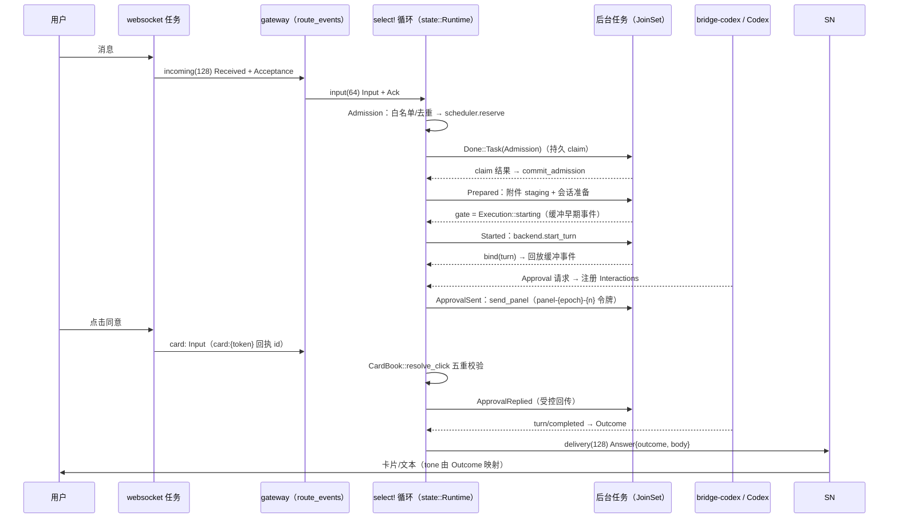
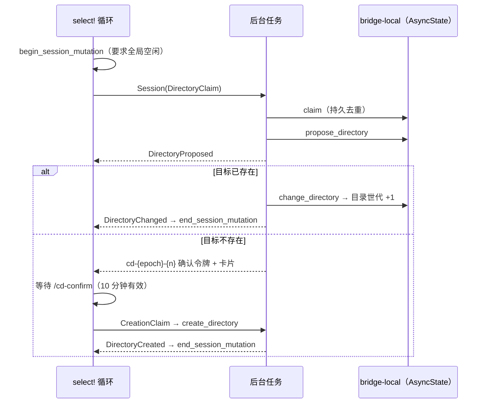
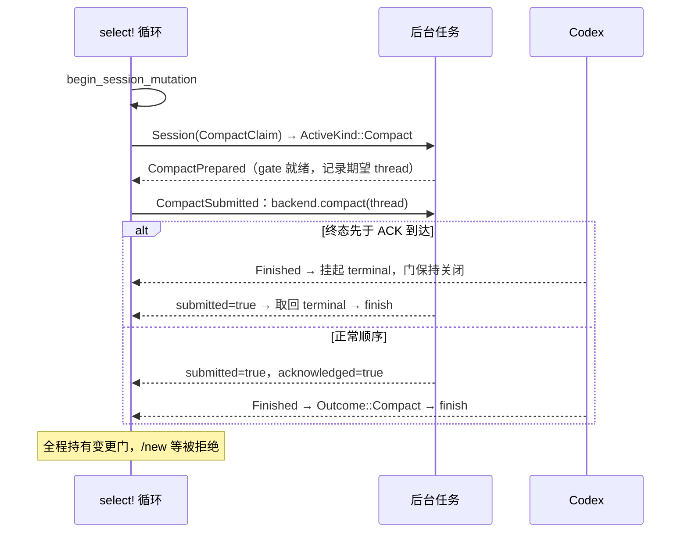
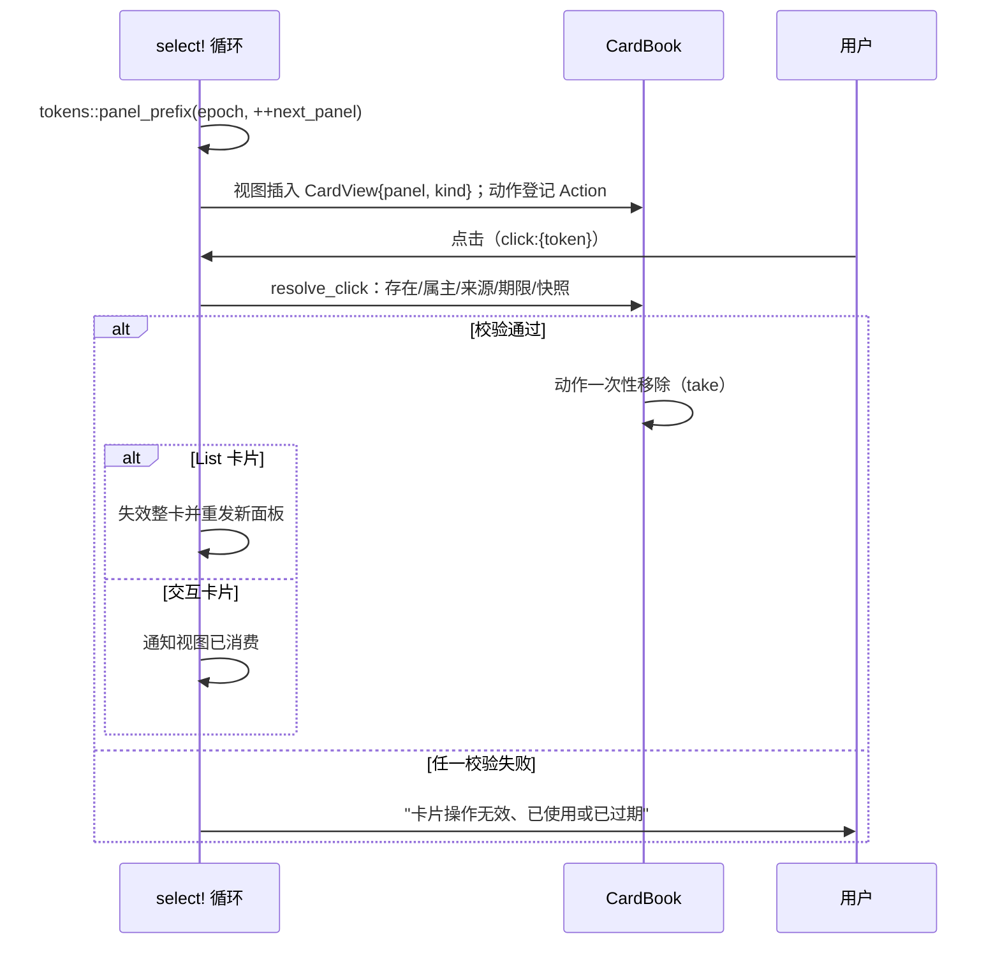

# 运行时序图

时序图只画真实存在的通道与函数。文本任务的主循环见 [architecture.md](architecture.md) 的运行时数据流。

## 文本任务执行（准入 → 审批 → 交付）

## /cd 切换目录（变更门 + 创建确认）

## Compact 生命周期

## 结果分类与 tone 映射

`Outcome`（`bridge-app::outcome`）是纯数据；`presentation::label/tone/finished_status` 是它到文案、卡片颜色与诊断状态的唯一映射：

| Outcome | 用户可见首句 | 卡片 tone | 诊断状态 |
|---|---|---|---|
| Completed | 执行完成 | Success | Ok |
| Stopped | 任务已停止 | Warning | Failed |
| BridgeStopped | 桥接已停止；未完成任务不会自动重跑。 | Warning | Failed |
| Failed | 执行失败：… | Error | Failed |
| PrepareFailed | 准备失败：… | Error | Failed |
| StartUnknown | 启动结果未知或失败：…；不会自动重试。 | Error | Failed |
| Compact(Completed) | 上下文压缩完成。 | Info | Failed |
| Compact(Stopped) | 上下文压缩已停止。 | Info | Failed |
| Compact(Failed) | 上下文压缩失败：… | Info | Failed |
| NotStarted | 卡片正文原样（如"系统繁忙…"） | Info | Failed |

## 卡片令牌生命周期

