# 运行时序图

时序图只画真实存在的通道与函数；参与者的名字都能在代码里找到（`runtime::Input`、`Done::Task`、`CardBook::resolve_click` 等）。系统结构与机制说明见 [architecture.md](architecture.md)，各 crate 的模块与常量清单见 [实现参考](crates/README.md)。

## 文本任务执行（准入 → 准备 → 执行 → 交付）

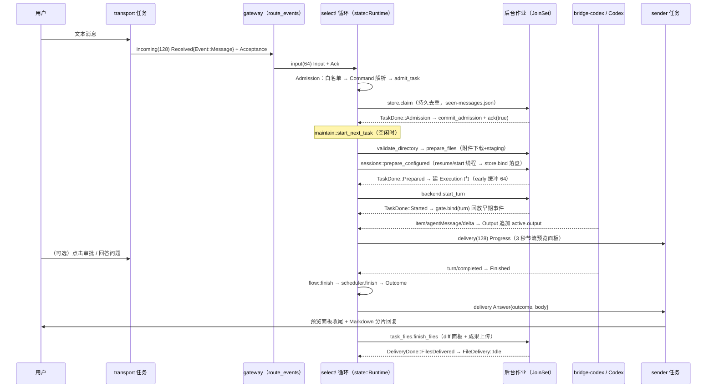

## 审批流（命令 / 文件修改 / 网络）

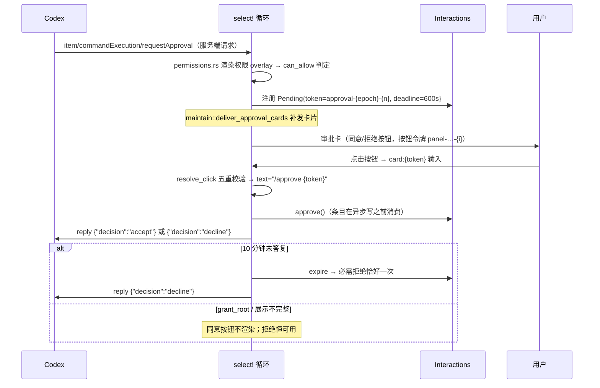

## 逐题问答（Plan 模式）

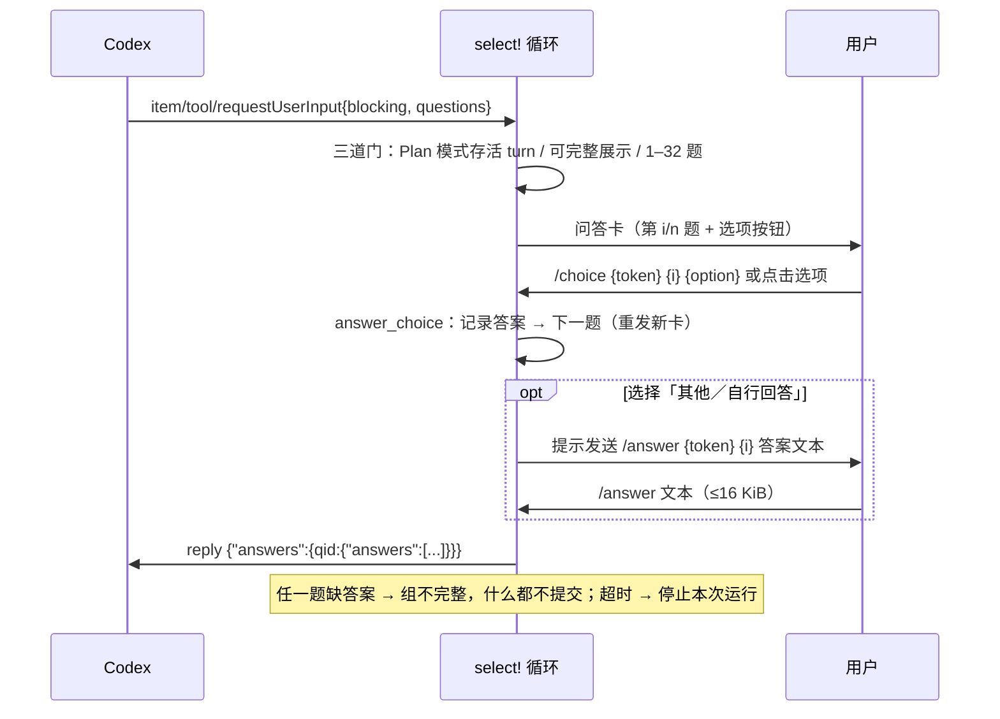

## /cd 切换目录（变更门 + 创建确认）

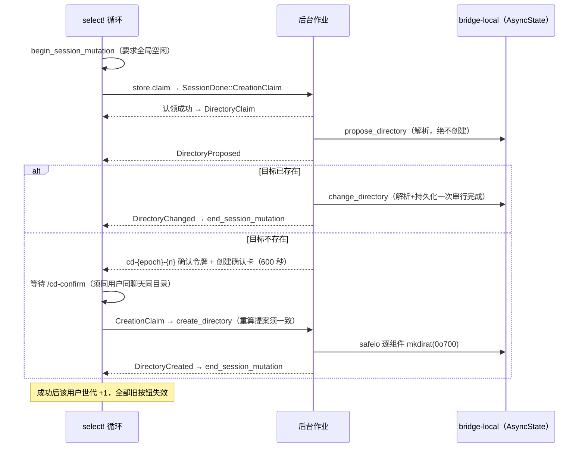

## /new 与 /resume（会话绑定）

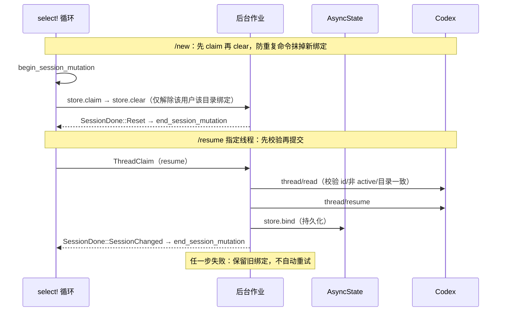

## 归档与对账

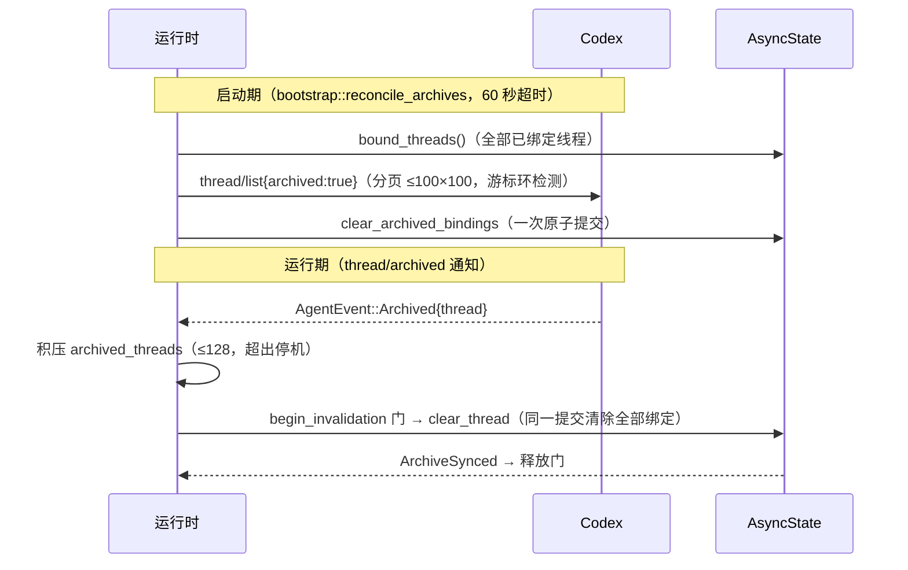

## Compact 生命周期（/compact）

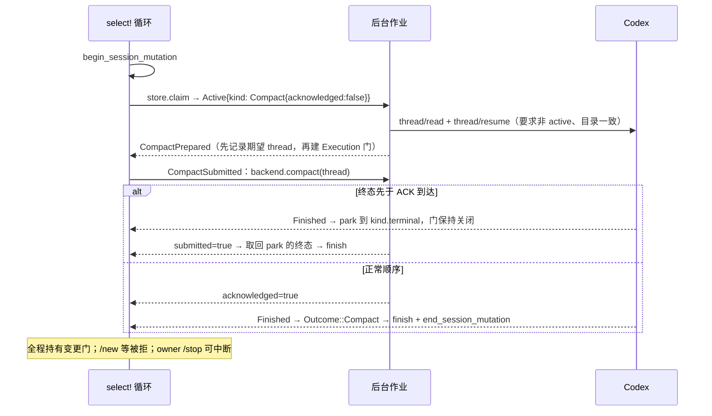

## /stop 与中断

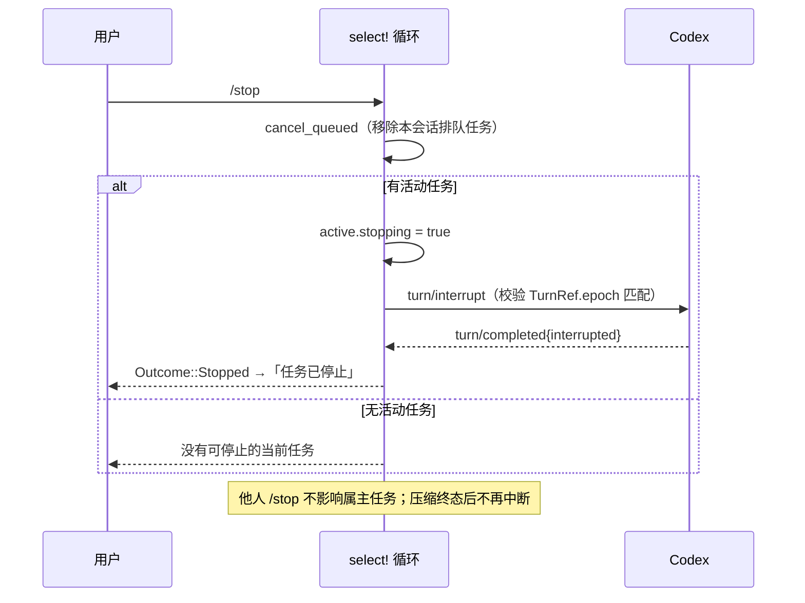

## Plan 确认（/plan-action）

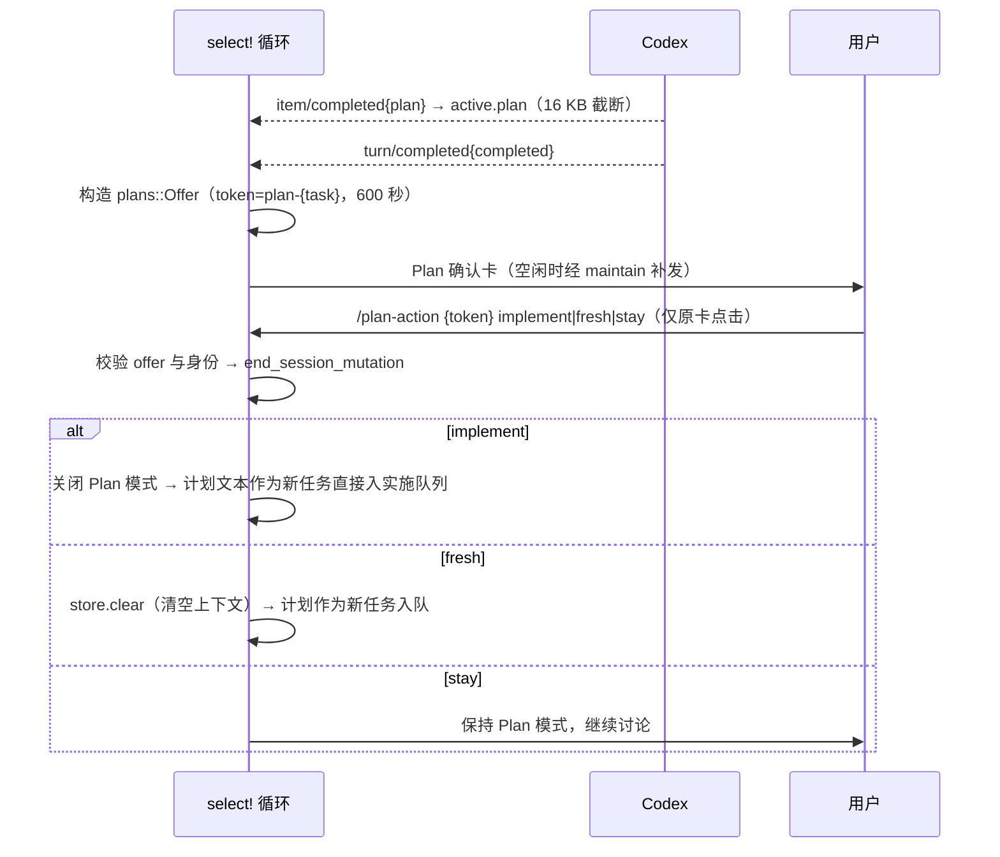

## 卡片令牌生命周期

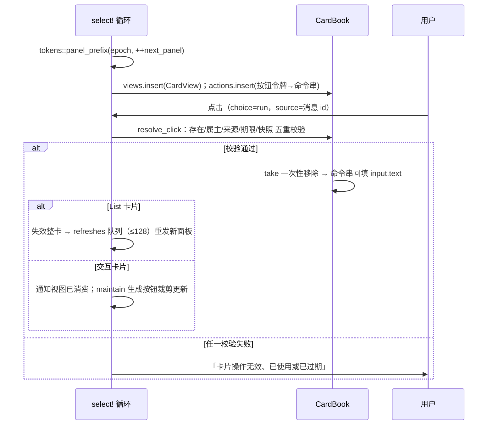

## 飞书 WebSocket 会话与重连

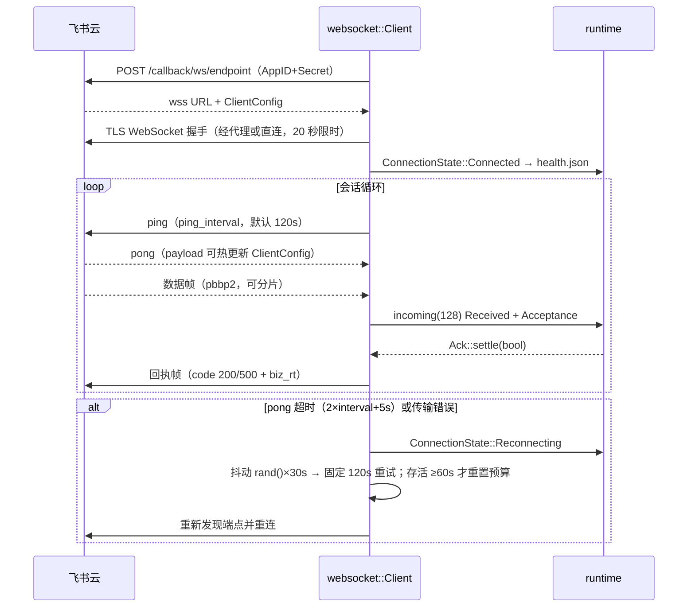

## 监督层重启与看门狗

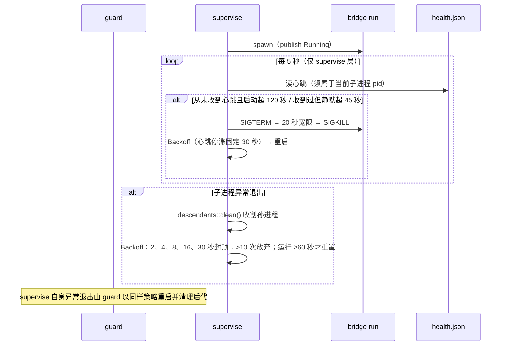

## 优雅关机（cancel 触发）

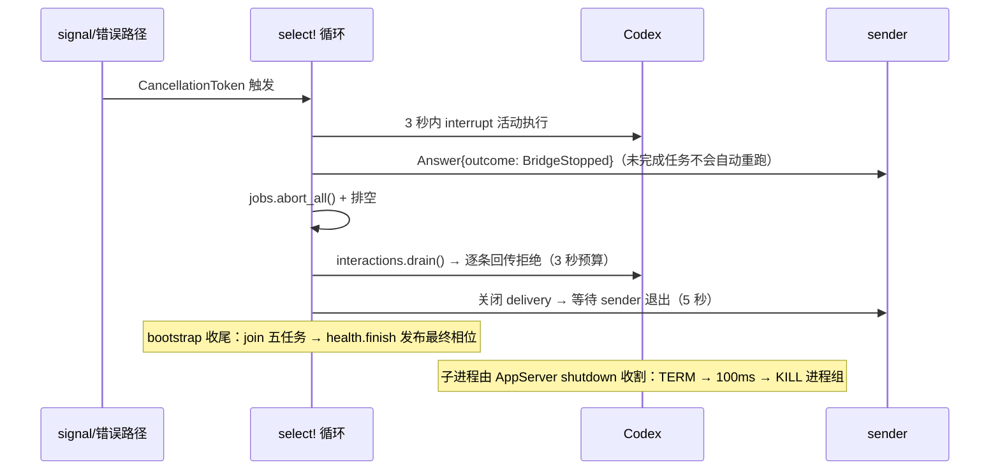

## 结果分类与 tone 映射

`Outcome`（bridge-app/src/outcome.rs）是纯数据；`presentation::label/tone/finished_status` 是它到文案、卡片颜色与诊断状态的唯一映射：

| Outcome | 用户可见首句 | 卡片 tone | 诊断状态 |
|---|---|---|---|
| Completed | 执行完成 | Success | Ok |
| Stopped | 任务已停止 | Warning | Failed |
| BridgeStopped | 桥接已停止；未完成任务不会自动重跑。 | Warning | Failed |
| Failed | 执行失败：… | Error | Failed |
| PrepareFailed | 准备失败：… | Error | Failed |
| StartUnknown | 启动结果未知或失败：…；不会自动重试。 | Error | Failed |
| Compact(Completed) | 上下文压缩完成。 | Info | Failed |
| Compact(Stopped) | 上下文压缩已停止。 | Info | Failed |
| Compact(Failed) | 上下文压缩失败：… | Info | Failed |
| Compact(PrepareFailed) | 压缩准备失败：…；不会自动重试。 | Info | Failed |
| NotStarted | 卡片正文原样（如「系统繁忙…」） | Info | Failed |

完整回复按 5500 字节分片（UTF-8 边界安全，代码围栏跨片自动闭合重开）；预览面板在答案发出前改为「本轮已结束」占位，避免旧进度误导。进度预览与最终回复共享同一面板句柄：预览失败后停止重试，但最终回复仍按分片补发。
